## Week 16 Homework Submission File: Penetration Testing 1

#### Step 1: Google Dorking

- Using Google, can you identify who the Chief Executive Officer of Altoro Mutual is:

      Karl Fitzgerald

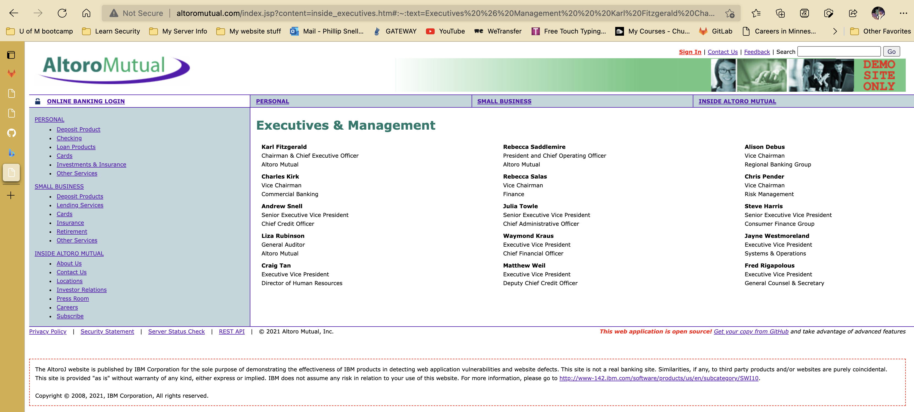

- How can this information be helpful to an attacker:

      Knowing who the CEO or any of the high officers can lead to a whaling attack. 

#### Step 2: DNS and Domain Discovery

Enter the IP address for `demo.testfire.net` into Domain Dossier and answer the following questions based on the results:

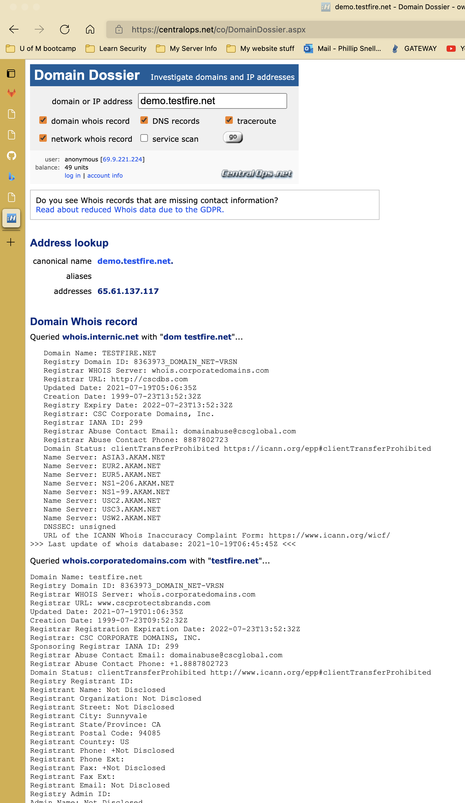

  1. Where is the company located:

         Sunnyvale CA 94085 US. 

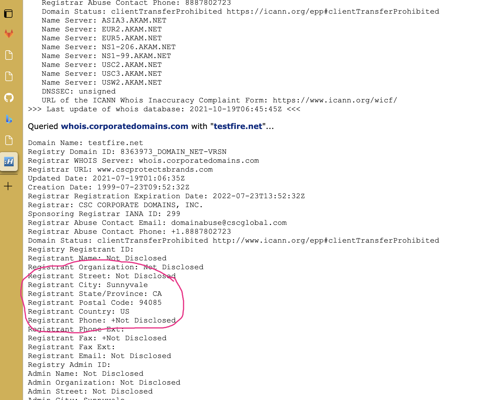  

  2. What is the NetRange IP address:

          65.61.137.64 - 65.61.137.127

  3. What is the company they use to store their infrastructure:

         They specialize in multi-cloud solutions. 

www.rackspace.com

  4. What is the IP address of the DNS server:

          65.61.137.117

#### Step 3: Shodan

- What open ports and running services did Shodan find:

          HTTP 80, HTTPS 443, and Apache 8080 

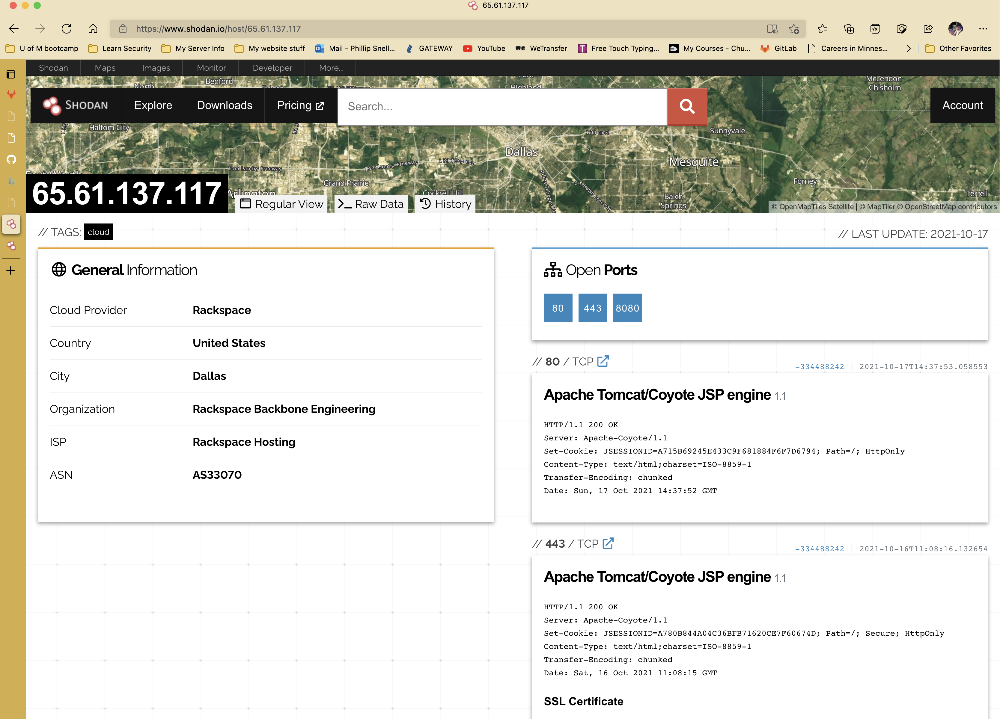

#### Step 4: Recon-ng

- Install the Recon module `xssed`.

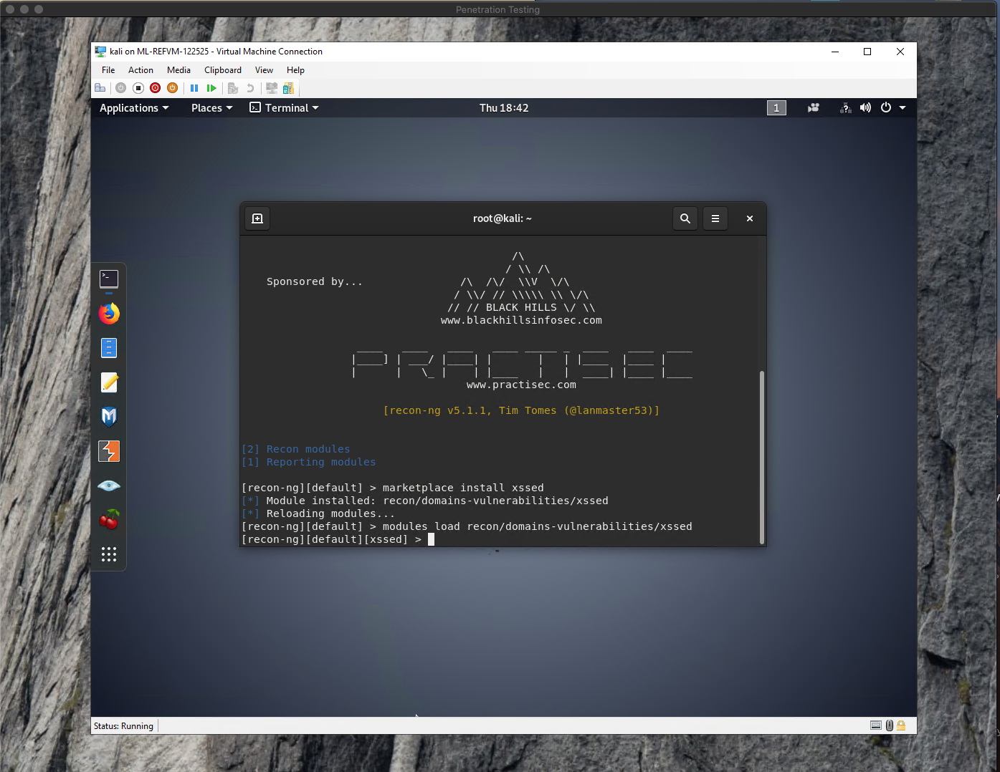

- Set the source to `demo.testfire.net`. 

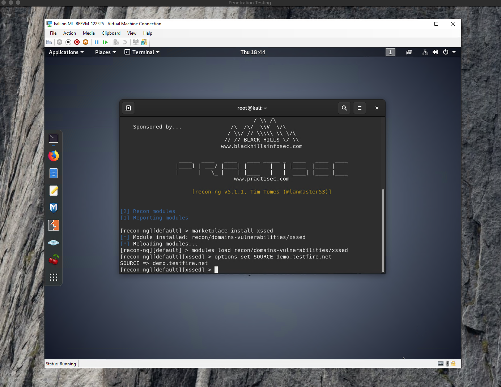

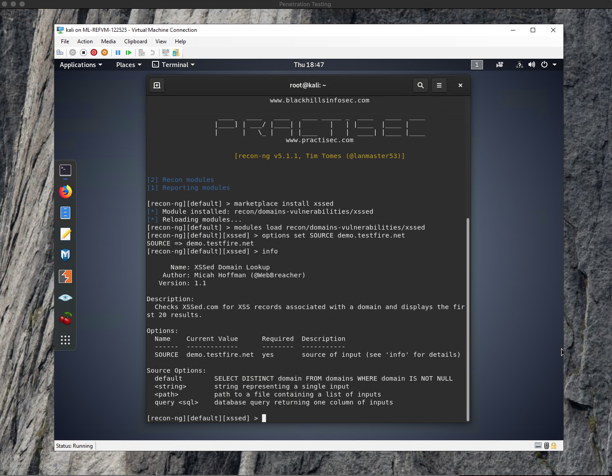

- Run the module. 

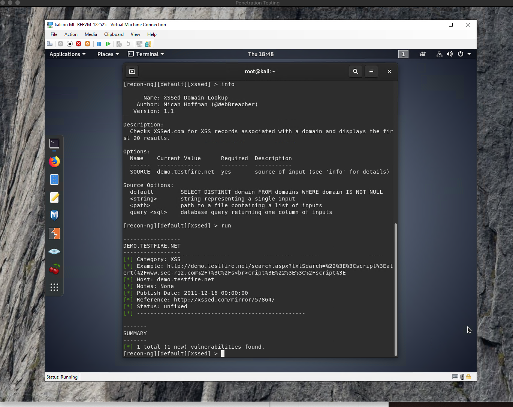

Is Altoro Mutual vulnerable to XSS: 

        YES!

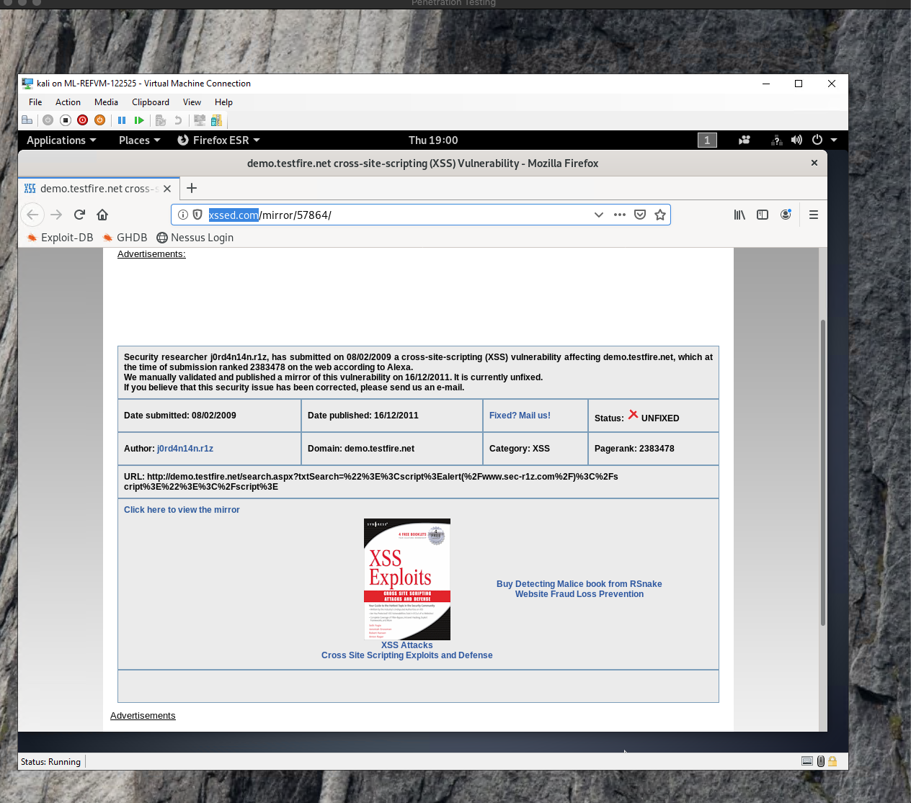

https://youtu.be/WgrBrPW_Zn4

### Step 5: Zenmap

Your client has asked that you help identify any vulnerabilities with their file-sharing server. Using the Metasploitable machine to act as your client's server, complete the following:

- Command for Zenmap to run a service scan against the Metasploitable machine: 

      nmap -sV -O -T4 -A -v ftp-vsftpd-backdoor 192.168.0.10
 
- Bonus command to output results into a new text file named `zenmapscan.txt`:

      nmap -sV -O -T4 -A -v -oN zenmapscan.txt 192.168.0.10

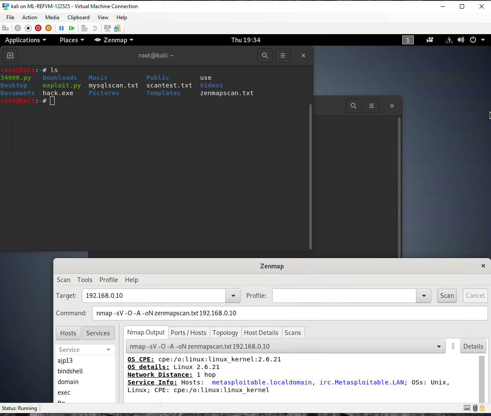

- Zenmap vulnerability script command: 

      nmap -sV -O -A --script ftp-vsftpd-backdoor 192.168.0.10

- Once you have identified this vulnerability, answer the following questions for your client:
  1. What is the vulnerability:

            This was a downloaded backdoor a signature with a smiley face on it. 

        

  2. Why is it dangerous:

            because the port was open and the backdoor was installed. after the exploit you are in as root. 

  3. What mitigation strategies can you recommendations for the client to protect their server:

            Update systems and patch turning on automatic updates, make sure to verify what you may or may not click on. Moving the files to another location can help also. 

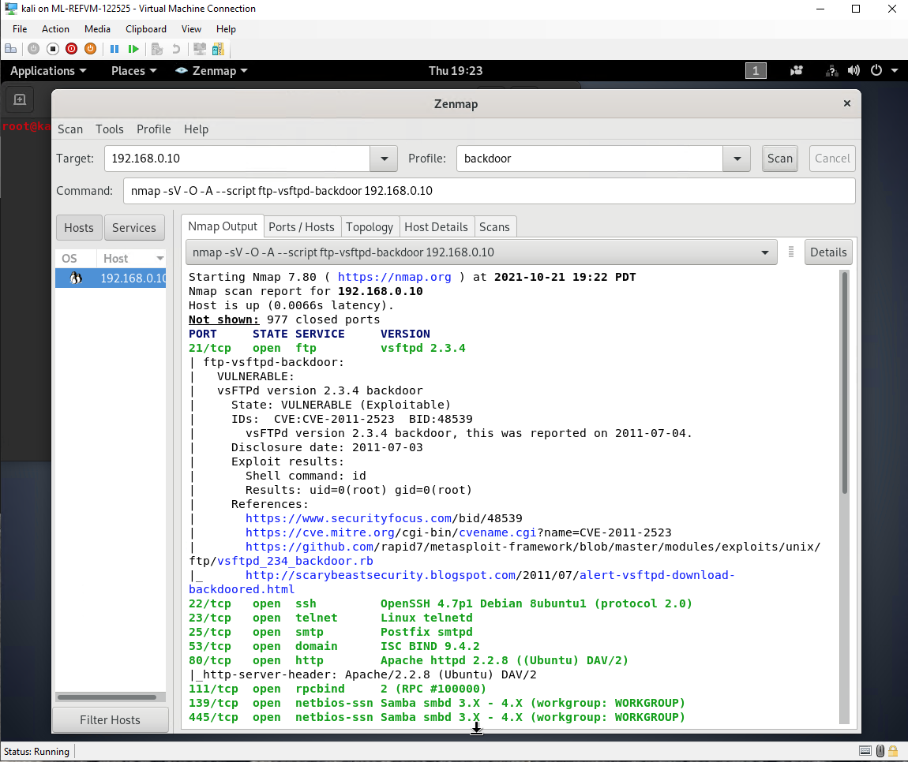

---
© 2020 Trilogy Education Services, a 2U, Inc. brand. All Rights Reserved.  

