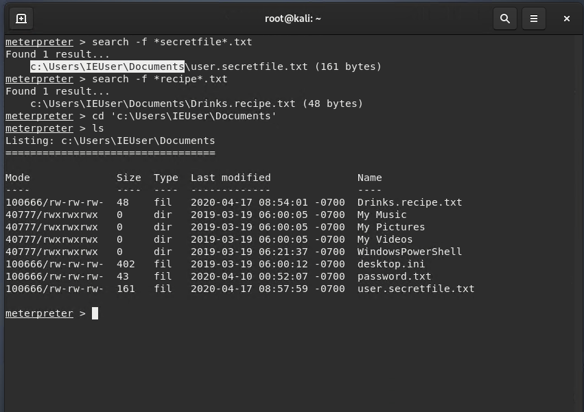

GoodSecurity Penetration Test Report 

Phillip_Snell@GoodSecurity.com

October 28, 2021

1.0	High-Level Summary

GoodSecurity was tasked with performing an internal penetration test on GoodCorp’s CEO, Hans Gruber. An internal penetration test is a dedicated attack against internally connected systems. The focus of this test is to perform attacks, similar to those of a hacker and attempt to infiltrate Hans’ computer and determine if it is at risk. GoodSecurity’s overall objective was to exploit any vulnerable software and find the secret recipe file on Hans’ computer, while reporting the findings back to GoodCorp.
When performing the internal penetration test, there were several alarming vulnerabilities that were
identified on Hans’ desktop. When performing the attacks, GoodSecurity was able to gain access to his machine and find the secret recipe file by exploit two programs that had major vulnerabilities. The details of the attack can be found in the ‘Findings’ category.

2.0	Findings

Machine IP:
                    
    192.168.0.20

Hostname: 

    MSEDGEWIN10

Vulnerability Exploited: 

        Icecast HTTP Header Buffer Overflow
        8000/tcp open http icecast streaming media server
        exploit/windows/http/icecast_header

Vulnerability Explanation:
    
`This exploits a buffer overflow in the header of the icecast. This exploit uses ExitThread() leaving icecast thinking its still in use.This vulnerability is written to memory rather than to disk. A buffer overflow occurs when a program or process attempts to write more data to a fixed length block of memory (a buffer), than the buffer is allocated to hold. By sending carefully crafted input to an application, an attacker can cause the application to execute arbitrary code, possibly taking over the machine. This is caused by a lot of times from poor management of memory.`

https://www.exploit-db.com/exploits/16763

https://www.coengoedegebure.com/buffer-overflow-attacks-explained/ 

Severity:

In your expert opinion, how severe is this vulnerability?

                I believe that this issue is a high vulnerability. 
                This attacker can gain full access to your system.

Proof of Concept:

Above is the code I ran to nmap this IP address 192.168.0.20. Finding ports open needed to attack this machine on port 8000 Icecast Streaming media server.

***********

Above is the list of exploits available, we will be focusing on the Windows exploit Windows_x86 header overwrite as shown below.

******

Above I ran msfconsole to be able to search for specific exploits and I found the icecast here using the search engine. 

*******

Above I ran use 0 for the located exploit I found in row zero. Then I want to see what is in the rule section here. I see I need to add the RHOSTS which is the ip of the victims computer 192.168.0.20.

Below i set the RHOSTS ip to the victims machine and checked to see that it is confirmed I ran show options to verify it has been put in place.

And by simply using Run or Exploit command to run the exploit. Here I used run and you can see I'm in the meterpreter. From here I will be able to exploit the victims machine by gaining access to files. 

******

Above I have gained access to the victims machine and now I'm able to surf his machine looking at files and such. As you can see i have now CD into the victims Documents files.

By having this privilege I can scan and view files like this one and found that it is the lime and the coconut!

And as you can see above here I ran a few more simple commands to find personal information about customers and critical information about the system they are using. 

Above I ran to see the users on the system and found 3 IEUser, sysadmin, and vagrant.

This screen shot above verifies the victims machine has the corresponding files. 

3.0	What recommendations would you give to GoodCorp?

`In this type of event I would start with education of my staff to make sure no subordinary files get loaded on any machines. Keeping a good house keeping policy helps harden any system. Updating software and firmware annually will harden the internal structure of your network. Creating strong passwords is attack number one, using two factor authentication is my best recommendation for any new network build or install.` 

Having backups and updating all the software and firmware will keep hardening the system. 

