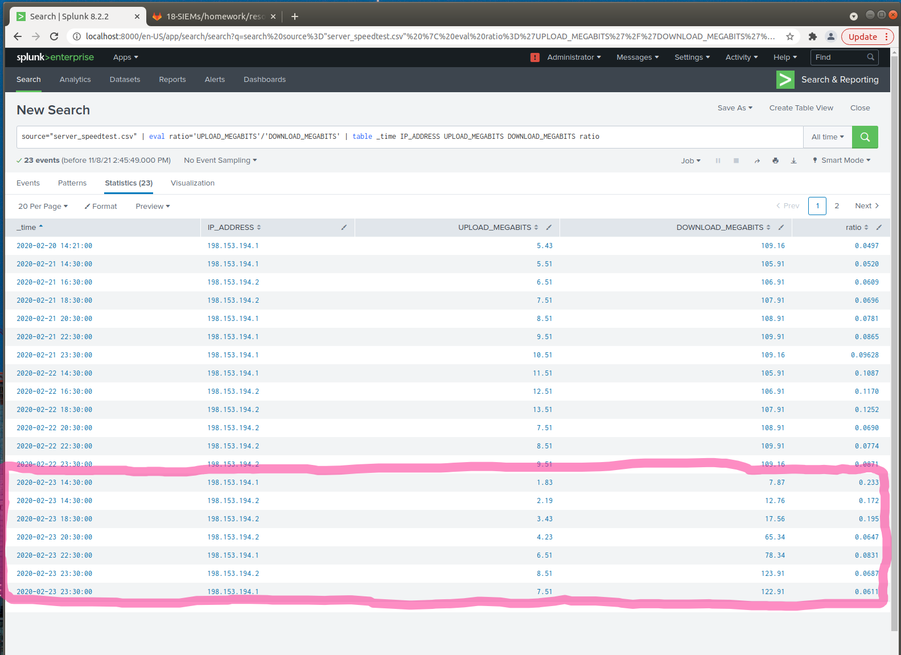
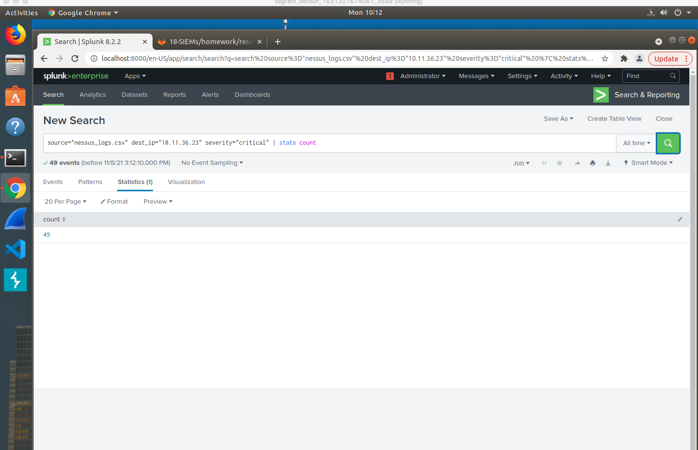
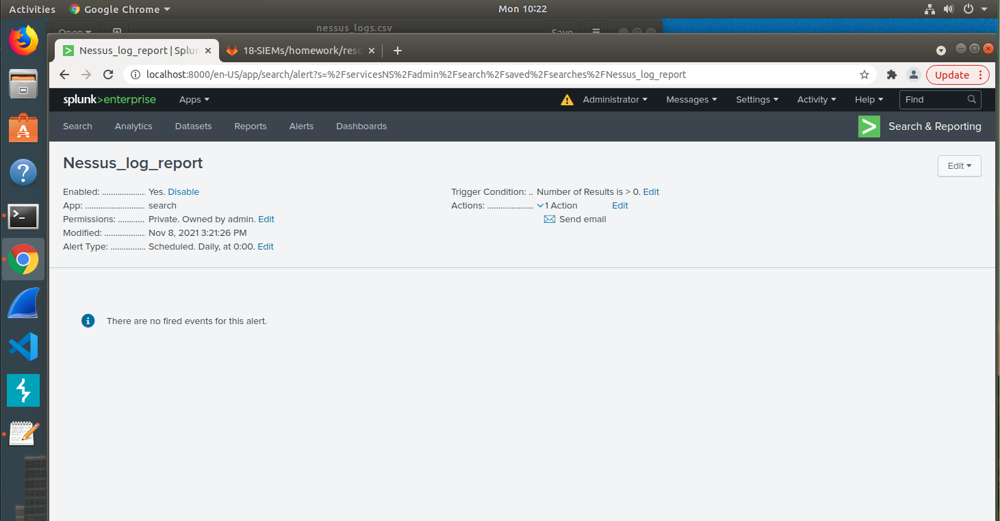
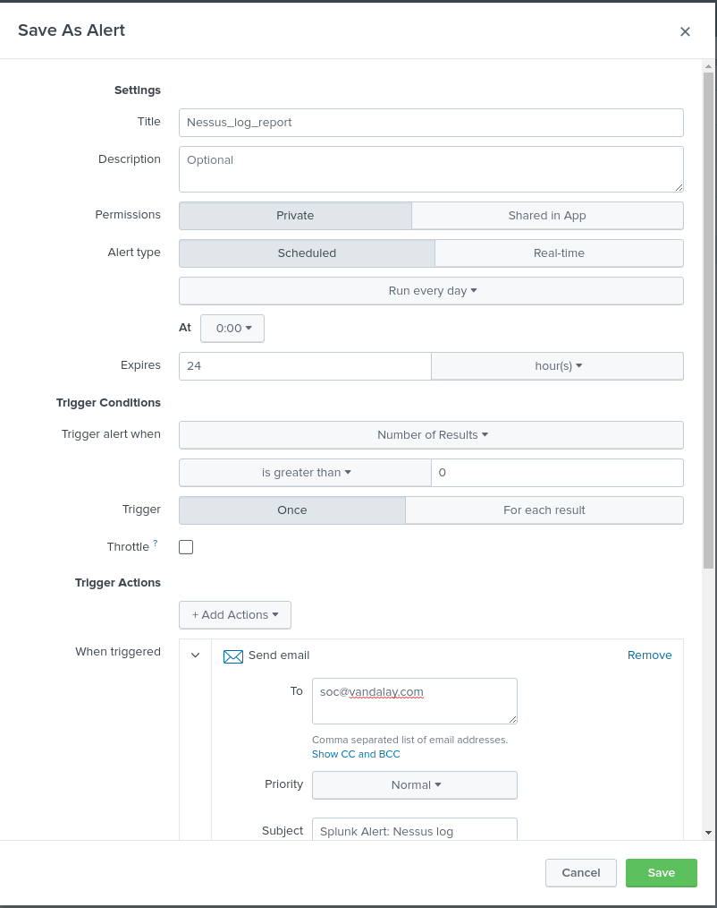
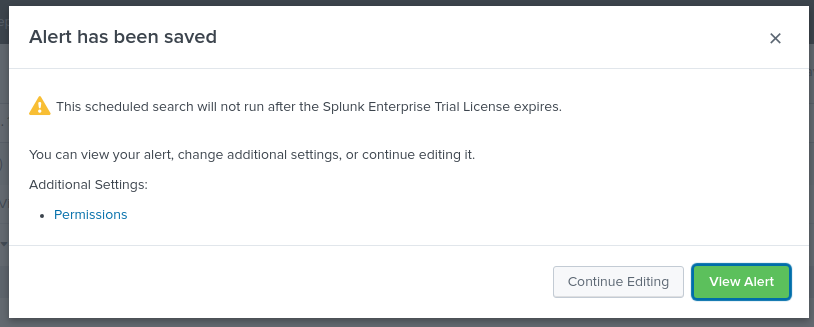
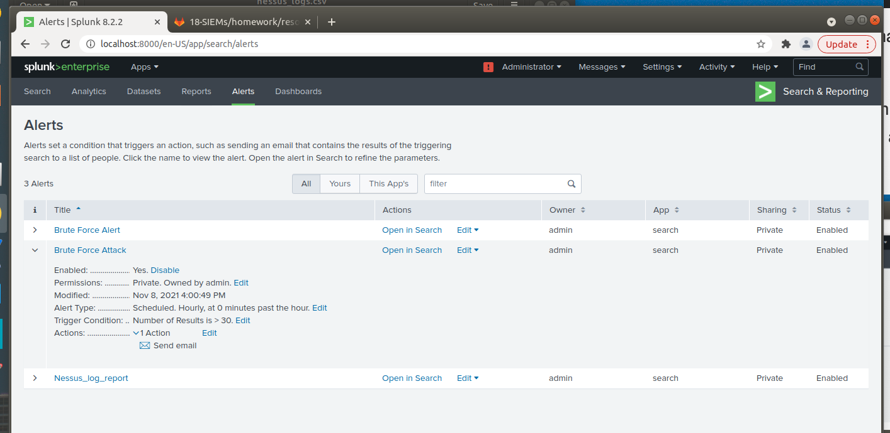
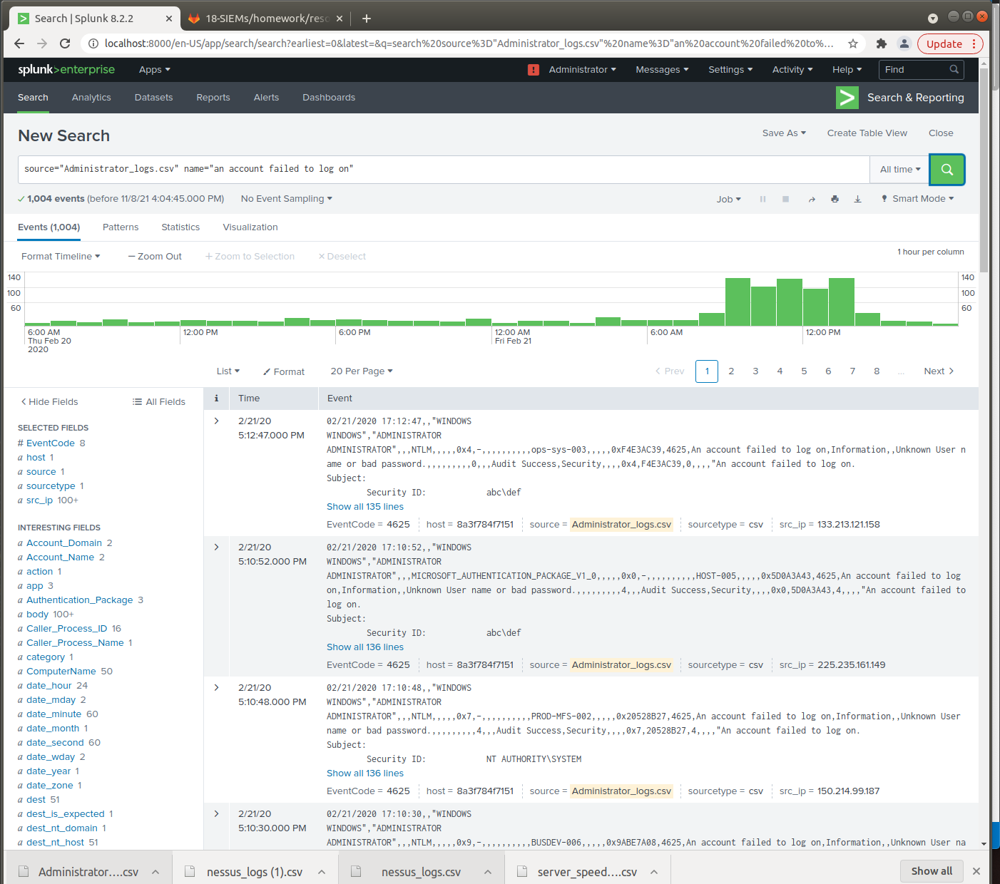
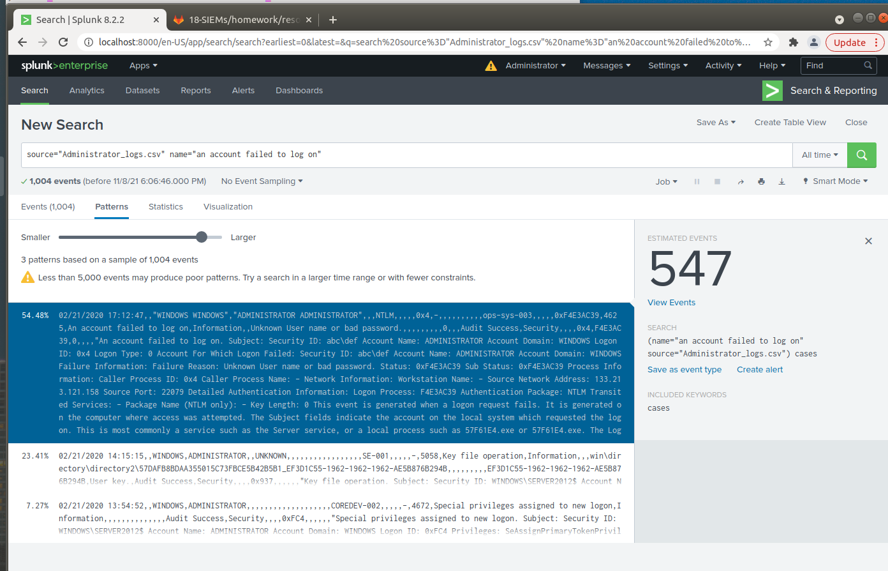

## Lets go Splunking!

## Vandalay Industries Monitoring Activity Instructions

### The Need for Speed 

**Background**: As the worldwide leader of importing and exporting, Vandalay Industries has been the target of many adversaries attempting to disrupt their online business. Recently, Vandaly has been experiencing DDOS attacks against their web servers.

Not only were web servers taken offline by a DDOS attack, but upload and download speed were also significantly impacted after the outage. Your networking team provided results of a network speed run around the time of the latest DDOS attack.

Create a report to determine the impact that the DDOS attack had on download and upload speed. Additionally, create an additional field to calculate the ratio of the upload speed to the download speed.

`Based on my report created, the approximated date and time of the attack was between 2:30Pm and 11:30pm on February 23, 2020.
The time it took to recover from this attack was 9 hours.` 

 
### Are We Vulnerable? 

**Background:**  Due to the frequency of attacks, your manager needs to be sure that sensitive customer data on their servers is not vulnerable. Since Vandalay uses Nessus vulnerability scanners, you have pulled the last 24 hours of scans to see if there are any critical vulnerabilities.

Create a report determining how many critical vulnerabilities exist on the customer data server. Then, build an alert to notify your team if a critical vulnerability reappears on this server.

   In the table below we have found 49 severity vulnerabilities from the input data we used. Information that was given was the destination ip 10.11.36.23 and we set the severity to critical.

   
      
3. Build an alert that monitors every day to see if this server has any critical vulnerabilities. If a vulnerability exists, have an alert emailed to `soc@vandalay.com`.

Below are alerts we built to monitor every day to see if this server has any critical vulnerabilities. If a vulnerability exists we have this set up to send an email alert to soc@vandalay.com  

### Drawing the (base)line

**Background:**  A Vandaly server is also experiencing brute force attacks into their administrator account. Management would like you to set up monitoring to notify the SOC team if a brute force attack occurs again.

Analyze administrator logs that document a brute force attack. Then, create a baseline of the ordinary amount of administrator bad logins and determine a threshold to indicate if a brute force attack is occurring.

Below we built charts to look at and monitor on a hour bases the amount of failed log in attempts. As you can see on the graph that between 8:00AM and 2:00PM there was a high spike in failed log in attempts. We set the email alert up to be sent for every 30 failed attempts to soc@vandalay.com 
As you see in the pattern chart that about half of the attempts were bad user names and passwords.

 

© 2020 Trilogy Education Services, a 2U, Inc. brand. All Rights Reserved.
