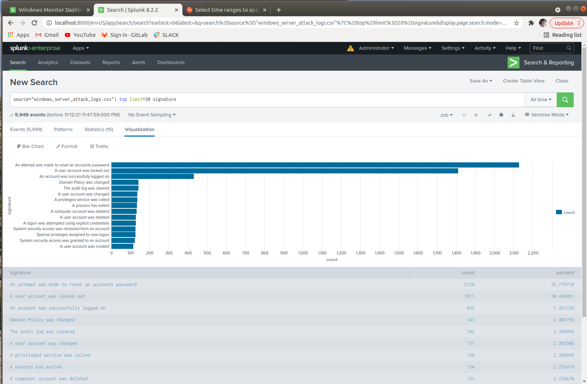

## Protecting VSI from Future Attacks
### Scenario
---
### Part 1: Windows Server Attack
Note: This is a public-facing windows server that VSI employees access.

- Several users were impacted during the attack on March 25th.
- Based on the attack signatures, what mitigations would you recommend to protect each user account? Provide global mitigations that the whole company can use and individual mitigations that are specific to each user.

`Upon the results found in my search and knowing the outcome of the attack brings to light the fact that the company world wide should implement colleague training starting from the head chief of staff on down to the working class. Having employees and staff change their passwords every 90 days and setting in place two factor authentication rules. Make passwords strong and have numbers and special characters included.`

  
- VSI has insider information that JobeCorp attempted to target users by sending "Bad Logins" to lock out every user.
- What sort of mitigation could you use to protect against this?

`After so many attempts to login an alert will notify users that they are getting near the limit of possible attempts to log in. If they do not abide by the set of rules they will be locked out for no less than 15 minutes but no more than 30, and they will need to meet group policy administration to gain access again.`
  
- Based on the geographic map, recommend a firewall rule that the networking team should implement.
- Provide a "plain english" description of the rule.
  - For example: "Block all incoming HTTP traffic where the source IP comes from the city of Los Angeles."
- Provide a screen shot of the geographic map that justifies why you created this rule. 

`As we took measures to verify that the most traffic was coming from the Ukraine seen on the geo-stat map we would want to set firewall rules eliminating those ip addresses coming into our network. By tracking and adding the ip addresses on to a blacklist and shutting down all un-used ports to make incoming traffic hard to get into our network.`

`Putting the above inbound traffic from the general internet all together or any other means of the network segment, making it hard for incoming traffic from the internet. This is where we will set the rules to disallow connections of any kind for malware and denial-of-service (DoS) attacks`

`Now lets not forget about the outbound traffic for any reverse action being taken on our network. setting up firewall protection against any websites, mail service, or VPN connections. for example any Post Office Protocol, internet message access protocol and simple mail transfer protocol.`

`The screen shots below show the hot spots and the amount of unwanted traffic coming form around the world. We will be focusing on the Ukraine because the graph shows the major amount of traffic is coming from there.`

`Allowing traffic that has been inspected by filtering out any bad traffic will allow you to continue to use the internet and having more than one layer of protection in your network. Having your firewall filter out packets coming in and going out will add to your security journey. But because we know that only one layer of protection is not enough for the common criminals we need to implement all levels of protection. Using stateful (Dynamic) packet filtering to protect against attacks that exploit layer protocols. Using transport layer protocol to encrypt packets we need to inspect packets deeper using decrypt and encrypting techniques. This set of rules will take a deeper look at the packets before letting the packets into our secure network.` 
  
### Please take a look at the video link below for a good explanation of this type of firewall security.

[FireWall Security quick video](https://youtu.be/5geL5yHpa2Q)

 

-------
 

- VSI has insider information that JobeCorp will launch the same webserver attack but use a different IP each time in order to avoid being stopped by the rule you just created.

- What other rules can you create to protect VSI from attacks against your webserver?
  - Conceive of two more rules in "plain english". 
  - Hint: Look for other fields that indicate the attacker.

`Using stateful firewall to examine packet to determine if the contents of the packet is related to any other sources in the network. Like using a different ip address to try and get by any firewall security set rules.`

`Next generation firewall using multi layered protection to 
prevent and brute force or DoS attacks. Inspecting packets and looking for packet that are trying to transport using specific ports TCP and dropping them if they are not friendly.`

The link below shows a few different types and protocols to use to protect against many types of attacks. My favorite would be the Next Generation Firewall because it works on many levels of the OSI model. 

[Different Type's of Firewalls](https://youtu.be/uGaERP4Npys)
 
[Reference link: by Ben Lutkevich,](https://searchsecurity.techtarget.com/definition/firewall?utm_source=youtube&utm_medium=description&utm_campaign=5geL5yHpa2Q&offer=video-5geL5yHpa2Q)

  

© 2020 Trilogy Education Services, a 2U, Inc. brand. All Rights Reserved.
