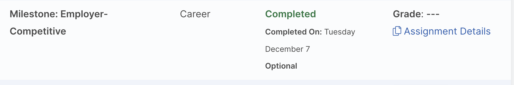
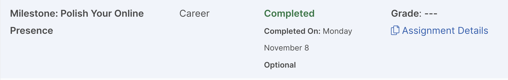
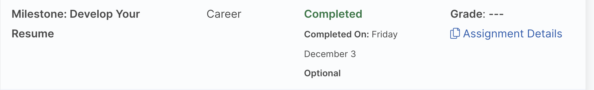
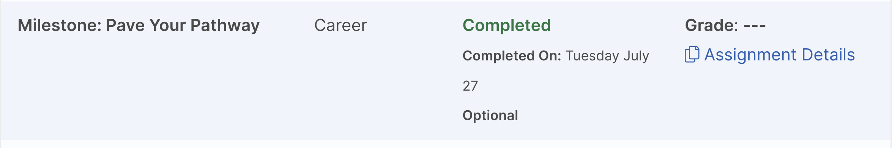

## Resume

- ##### LinkedIn www.linkedin.com/in/phillip-snell

- ##### GitHub Repository https://github.com/flipifucan

- ##### Website #1 WordPress https://milkboneproduction.com

- ##### Website #2 Code written by hand https://phillipsnellportfolio.com

 

PHILLIP SNELL
Forest Lake, MN 55025 • 612-860-0239 • phillip-snell@outlook.com
WEBSITE, PORTFOLIO, PROFILIO
https://phillipsnellportfolio.com/
https://milkboneproduction.com/ 
www.linkedin.com/in/phillip-snell
flipifucan (github.com)

- PROFESSIONAL SUMMARY

Detail-oriented technology professional with associates degree in Applied Business-Business Management with a Cyber Security Focus expected 2023. Proven success working in a fast-paced work environment to bring projects to completion. Strong verbal, written, and interpersonal communication skills. Experienced working with teams to produce impactful, leading-edge websites that engage customers and deliver business results. Well-versed in design standards and user preferences. Driven student leveraging studies in Cyber Security seeks real-world experience in an entry level position. Ready to help the team achieve company goals. Results-driven IT professional with notable success in planning, analysis, and implementation of security initiatives. Strengths in providing comprehensive network design and security frameworks. Certified in Security+ expected December 2021. Information Security Specialist with passion for aligning security architecture plans and processes with security standards and business goals. Extensive experience developing and testing security framework for cloud-based software. Versed in robust network defense strategies.
 

- SKILLS

Complex Problem Solving
Back-End and Database
Scripting Languages: PHP, Python, JavaScript
Analytical Thinking
Front-End Skills: HTML, CSS	Azure Deployment
Website Maintenance
Decision Making
Communication and Interpersonal
Front-End Programming: HTML5, CSS3
PROFESSIONAL EXPERIENCE
Front End Developer, 09/2017 to Current
Self Employed Web – St. Paul, MN
Use Oracle SQL to communicate with relational databases and retrieve data.
Apply PL/SQL procedural language extension and basics using blocks, subprograms, and triggers. Java environment and syntax, from arrays, inheritance, and interfaces exceptions and collections. How to create state-of-the-art responsive websites using modern CSS3, HTML, and JavaScript.
 
  

- Mobile and Desktop Web Developer / Responsive Web Design, 08/2018.

Programming websites to function across smartphones, tablets, and desktops environments. Building dynamic, mobile-first websites using CSS and JavaScript.
Fundamentals of PHP, SQL, XML, jQuery, Bootstrap, and WordPress.
Website Manager, 09/2017 to Current
Self Employed Web – St. Paul, Minnesota
Manage creation of landing pages for two websites.
Use Visual Studio Code to write my own code, adding each page to my websites.
Use JavaScript for functionality and CSS3 for design all written in HTML5.
Millwright, 09/2000 to 03/2021
Gerdau Ameristeel – St. Paul, MN
Welded, fabricated, and repaired heavy-duty industrial equipment including overhead crane.
Scheduled preventative maintenance for all onsite equipment and conducted major repairs including
component replacement and/or rebuilds of gearbox and wheel bearings.
Tested water treatment and to maintain water chemistry.
Performed troubleshooting of hydraulic and pneumatic circuits.
Researched internet for repair methods, tracked inventory and daily reports (Microsoft Excel) and
stored/organized scheduled maintenance records using Prizm.
Maintenance schedule for all on site equipment.
Performed schematic reading and understanding and heavy-duty equipment operations include man lifts
(JLG), Mobile Grove and Fuchs (Terex) crane, front end Volvo loader and skid steers, SW1200
Locomotives.

Bus Driver, 03/2015 to 03/2016
Metro Transit – Minneapolis, Minnesota
Performed pre-trip vehicle inspections, transported passengers over specified routes, and collected fares. Communicated delays and route changes to passengers, ensured cleanliness of vehicle, and safely drive bus in all traffic and weather conditions.
Transported passengers safely along prescribed routes according to tight schedules.
Performed bus driving duties while keeping student safety in mind to maintain a good safety record. Assisted passengers with disabilities and other physical issues in boarding and exiting the bus to promote passenger safety.
Followed established routes with aid from maps and GPS-equipped devices to safely navigate high-traffic areas and adhere to preset schedules.

- EDUCATION

Associates of Applied Science: Business Management, Cyber Security, Expected in 09/2023 Eastern Gateway - Ohio City, OH
 
U of M Bootcamp CompTIA Security+ Certification: Expected in 12/2021 University of Minnesota Cybersecurity Boot Camp - St. Paul MN

Networking: Packet Analysis Wireshark: Cyber Security, Expected in 12/2021
University Of Minnesota - Twin Cities - Minneapolis, MN

Systems Windows and Linux Administration Techniques Windows and Linux Hardening Cybersecurity Secure Network Design and Architecture Risk Management Cryptography Vulnerability Assessment Identity and Access Management Cloud Security Ethical Hacking and Penetration.

- No Degree: Mobile and Desktop Web Developer Century College - Saint Paul, MN
Certification of Completion 

- Advanced PLC's, Circuit and Design, SolidWorks, Mobile Hydraulics: Fluid Power Engineering, 05/2010
Hennepin Technical College - Brooklyn Park, MN

Fluid Power Tech II, Components and Electricity II. Served as student aid and tutored other students. Built PLC three motor start up test stand for new students to use during class; the test stand continues to be used as a hands-on tool.

- No Degree: Recording Engineer
Music Tech - Minneapolis MN

Music Tech, Minneapolis Minnesota Recording Engineering Diploma Understanding signal flow, troubleshooting and repair of electronic equipment. Servicing equipment in class A studios: soldering wires, repairing circuit boards and patch bays. How to use new and updated software programming to link outboard processing gear to computers via interfaces. Studio training included attention to details and focusing on the audio and how it needs to be controlled. Using process gear to equalize, compress and mix audio to be at its best output level. Received Certification of Completion.
              ACCOMPLISHMENTS
Gerdau, St. Paul, Minnesota Millwright Apprenticeship Program 4 years.
Repair of hydraulics, electricity, robotics, and Alan Bradley Programmable Logic Controller ESCO Institute Universal Certification – EPA Section 608.
