# Unit 15 Homework

1. **Deliverable**: Take a screen shot confirming that this exploit was successfully executed and provide 2-3 sentences outlining mitigation strategies. 

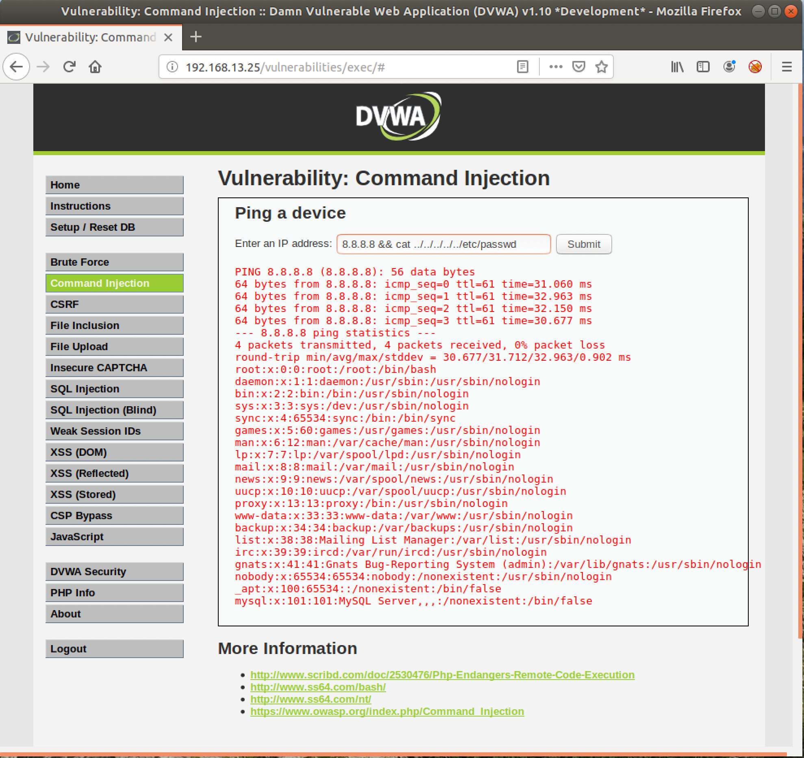
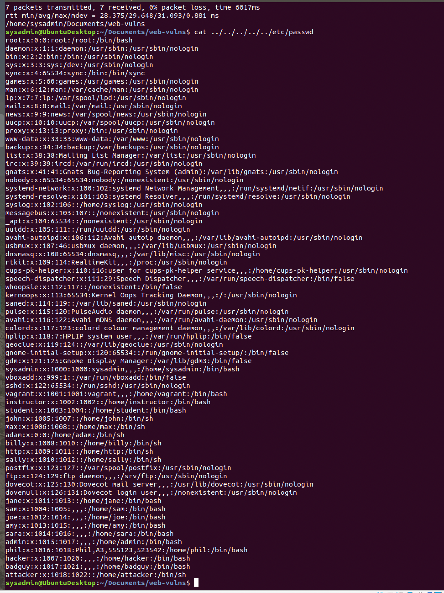
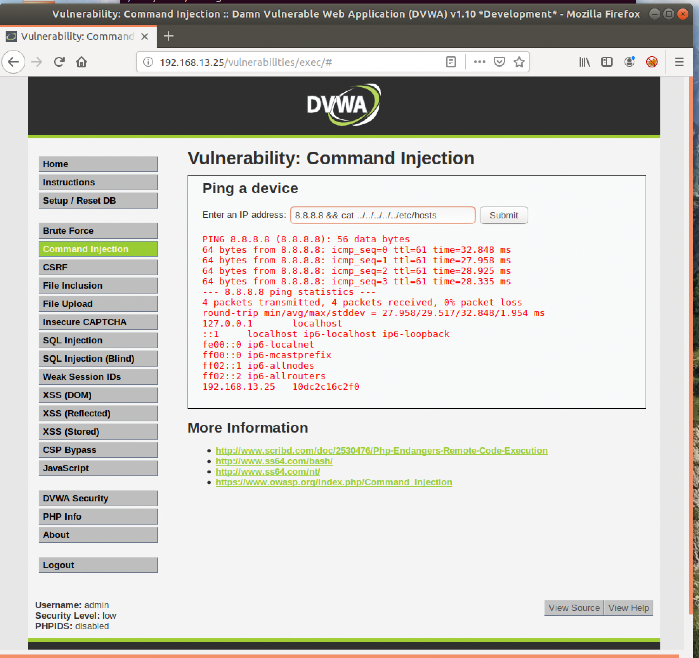
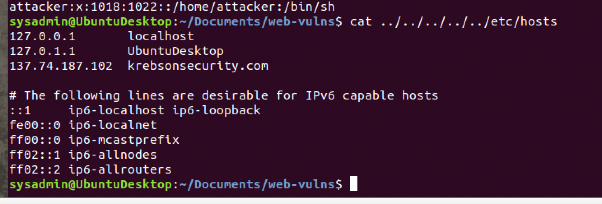

    To avoid command injection developers should not allow operating system commands, instead should use API key provided by the framework they are using. Don't just let anyone type in the date command and be able to modify it from there. Instead, developers should use a more complicated framework to get the date. Lack of input and output validation is a huge problem in command injection. Whitelisting good values will help a lot.
     
    
:smiley:

 
2. **Deliverable**: Take a screen shot confirming that this exploit was successfully executed and provide 2-3 sentences outlining mitigation strategies. 

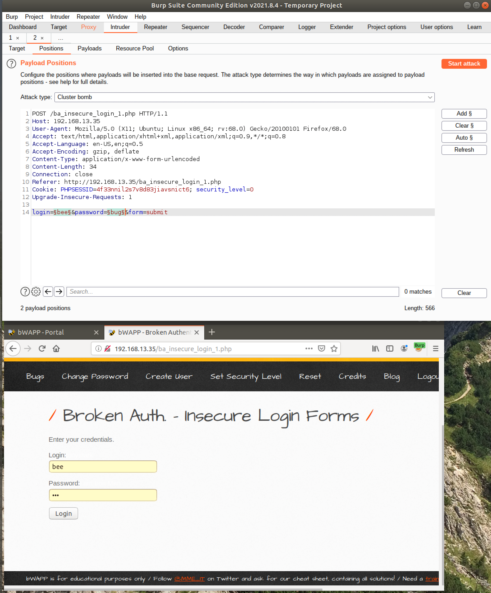

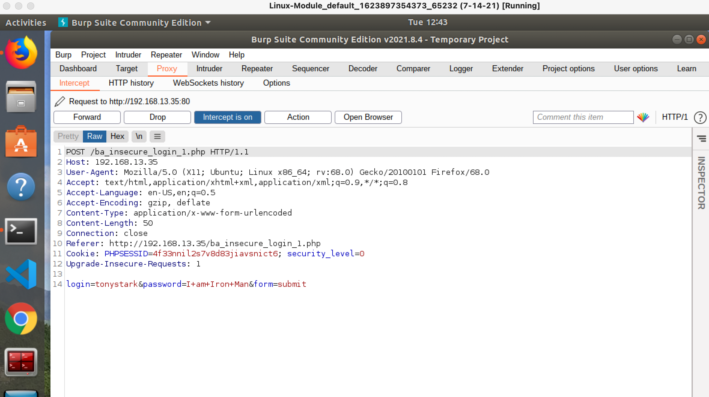

    Making passwords long and strong is a direction to go at first. Preventing brute force attacks helps by using tools and techniques available to you. Do not use typical password fraises like dog names or birthdays. Use long and destructive words. Use different passwords for different sites. Use numbers and special characters as much as possible. Use random strings not something you will find in a dictionary. Use tools to limit login attempts. My favorite is implementing 2FA all around. Oh and last but not least CAPTCHA telling if you are human or not! Lol.  
:smiley:

    
3. **Deliverable**: Take a screen shot confirming that this exploit was successfully executed and provide 2-3 sentences outlining mitigation strategies. 

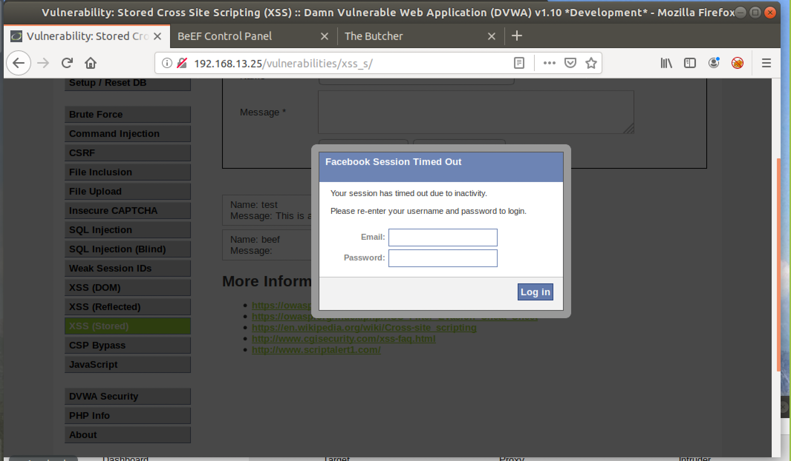

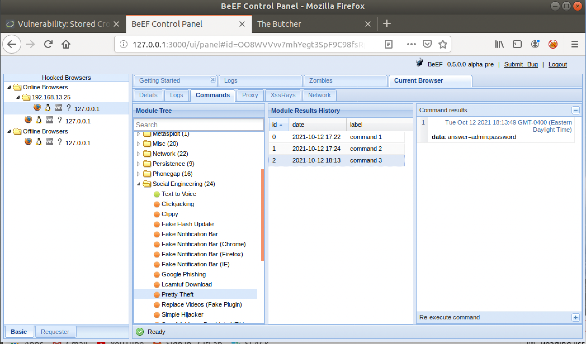

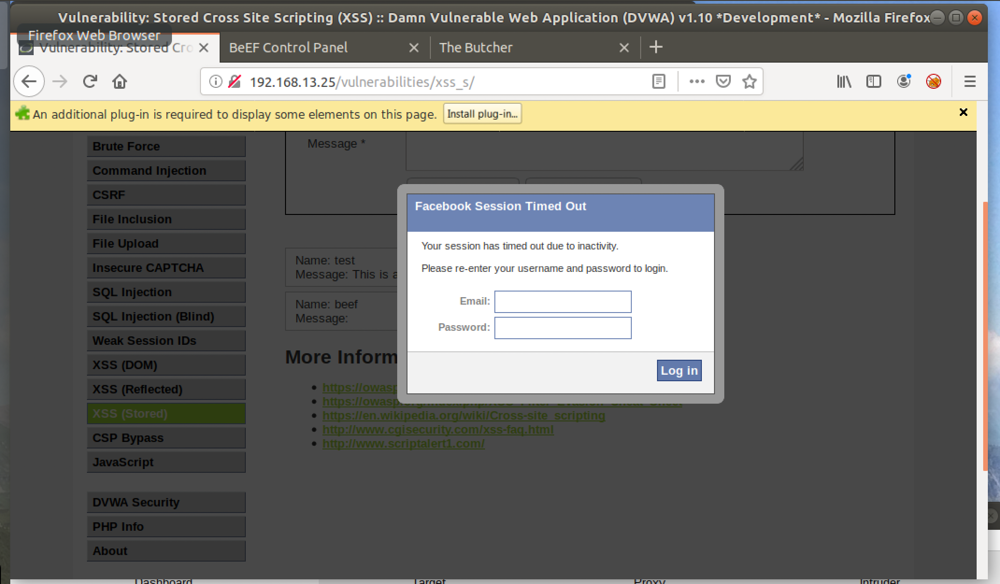

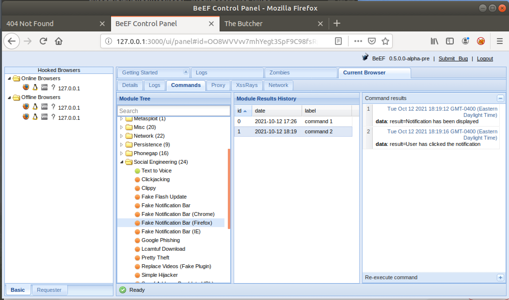

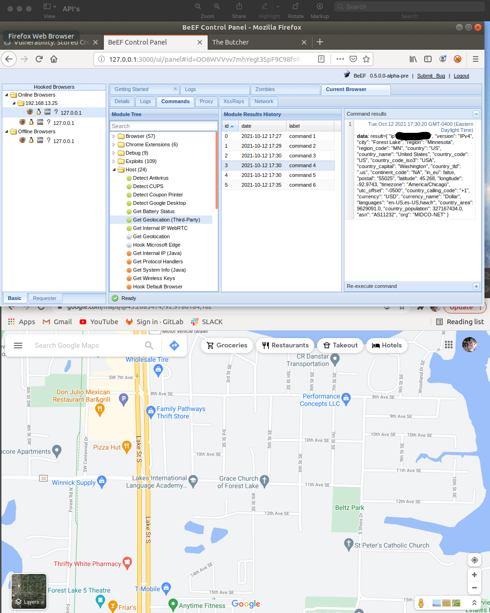

    One of the most effective ways to prevent OS Command Injection is to implement platform APIs to provide the functionality instead of calling out directly to the underlying Operating System. Failing that, strong input validation methods must be implemented

:smiley:
---

