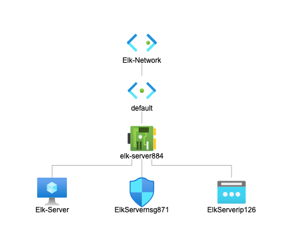

## Automated ELK Stack Deployment

The files in this repository were used to configure the network depicted below.

 

These files have been tested and used to generate a live ELK deployment on Azure. They can be used to either recreate the entire deployment pictured above. Alternatively, select portions of the `.yml` file may be used to install only certain pieces of it, such as Filebeat.

  - _TODO: Enter the playbook file._

        Files have been edited and updated.
            Click On The Links Below.

  [Filebeat-Config](filebeat-configuration.yml)

  [Filebeat-Playbook](filebeat-playbook.yml)

  [Metricbeat-Configurat](metricbeat-configuration.yml)

  [Metricbeat-Playbook](metricbeat-playbook.yml)

  [Install-Elk-Playbook](install-elk.yml)

  [Host](hosts.yml)

This document contains the following details:
- Description of the Topology

- Access Policies
- ELK Configuration
  - Beats in Use

                Filebeat and Metricbeat
  - Machines Being Monitored
                
                Web-1 and Web-2
- How to Use the Ansible Build

### Description of the Topology

The main purpose of this network is to expose a load-balanced and monitored instance of DVWA, the D*mn Vulnerable Web Application.

Load balancing ensures that the application will be highly accessible, in addition to restricting any inbound traffic to the network.
- _TODO: What aspect of security do load balancers protect? What is the advantage of a jump box?_

      They are closed to inbound traffic unless opened by admins.
      ElkStack is used to monitor mega data and proccess this information to let admins monitor the daily logs and machines running. 

Integrating an ELK server allows users to easily monitor the vulnerable VMs for changes to the _____ and system _____.
- _TODO: What does Filebeat watch for?_

        Monitors Logs sends them to elkstack for proccessing or indexing. 

        

- _TODO: What does Metricbeat record?_

        Monitors CPU if it gets high you know you have an issue like too many log in attempts. 

The configuration details of each machine may be found below.
_Note: Use the [Markdown Table Generator](http://www.tablesgenerator.com/markdown_tables) to add/remove values from the table_.

| Name     | Function      | IP Address  | Operating System |
|----------|----------     |------------ |------------------|
|Phillip   | Local Host    | 69.8.223.334| MacOs            |
|Jump Box  | Gateway       | 10.0.0.4    | Linux            |
|Elk-Server| Monitoring    | 10.1.0.5    | Linux            |
|Web-1     | DVWA Server   | 10.0.0.5    | Linux            |
|Web-2     | DVWA Server   | 10.0.0.7    | Linux            |

### Access Policies

The machines on the internal network are not exposed to the public Internet. 

Only the `Jump-Box Provisioner` machine can accept connections from the Internet. Access to this machine is only allowed from the following IP addresses:
- _TODO: Add whitelisted IP addresses_
          
          Local Host IP

Machines within the network can only be accessed by `Jump-Box Provisioner`.
- _TODO: Which machine did you allow to access your ELK VM? What was its IP address?_
          
          Jump-box and host machine 

A summary of the access policies in place can be found in the table below.

| Name        | Publicly Accessible | Allowed IP Addresses      |
|-------------|---------------------|---------------------------|
| Jump Box    | Yes  port 22 TCP    | 10.0.0.4 - 20.106.143.99  |
| Elk-Server  | No  port 5601 ANY   | 10.1.0.5 - 20.80.180.39   |
| Web-1       | No   port 22 TCP    | 10.0.0.5 - 20.85.215.4    |
| Web-2       | No   port 22 TCP    | 10.0.0.7 - 20.85.215.4    |
| Web-3       | No   port 22 TCP    | 10.0.0.6 - Out of Service |

### Elk Configuration

Ansible was used to automate configuration of the ELK machine. No configuration was performed manually, which is advantageous because...
- _TODO: What is the main advantage of automating configuration with Ansible?_

        Pass te buck$$$ automation is the future and if you can free up admins for other work, moving forward, the furture will look brighter. Automating daily tasks is best practice to elliminate errors also. By using the same playbooks updating and installing web servers to the network will be much faster and easier.

The playbook implements the following tasks:
- _TODO: In 3-5 bullets, explain the steps of the ELK installation play. E.g., install Docker; download image; etc._
- ... Install Docker add containers as needed.
- ... Install Ansible configure playbooks and config files. 

The following screenshot displays the result of running `docker ps` after successfully configuring the ELK instance.

### Target Machines & Beats
This ELK server is configured to monitor the following machines:
- _TODO: List the IP addresses of the machines you are monitoring_

        Web-1 10.0.0.5 and Web-2 10.0.0.7

We have installed the following Beats on these machines:
- _TODO: Specify which Beats you successfully installed_

      Filebeats and metricbeats

These Beats allow us to collect the following information from each machine:
- _TODO: In 1-2 sentences, explain what kind of data each beat collects, and provide 1 example of what you expect to see. E.g., `Winlogbeat` collects Windows logs, which we use to track user logon events, etc._

### Using the Playbook
In order to use the playbook, you will need to have an Ansible control node already configured. Assuming you have such a control node provisioned: 

SSH into the control node and follow the steps below:
- Copy the` filebeat-playbook.yml and metricbeat-playbook.yml` file to` a nano filebeat-playbook.yml and metricbeat-playbook.yml in my /etc/ansible/files directory`.
- Update the` filebeat-config.yml and metricbeat-config.yml`file to include...`IP address of Elk server 10.1.0.51 on specific ports`
- Run the playbook, and navigate to` Kibana (http://20.80.180.39:5601/app/kibana)` to check that the installation worked as expected.

 

_TODO: Answer the following questions to fill in the blanks:_
- _Which file is the playbook? Where do you copy it?_
- _Which file do you update to make Ansible run the playbook on a specific machine? How do I specify which machine to install the ELK server on versus which to install Filebeat on?_
- _Which URL do you navigate to in order to check that the ELK server is running?

_As a **Bonus**, provide the specific commands the user will need to run to download the playbook, update the files, etc._

        cd /etc/ansible/files then run theses below
        ansible-playbook install-elk.yml
        ansible-playbook filebeat-playbook.yml and ansible-playbook metricbeat-playbook.yml