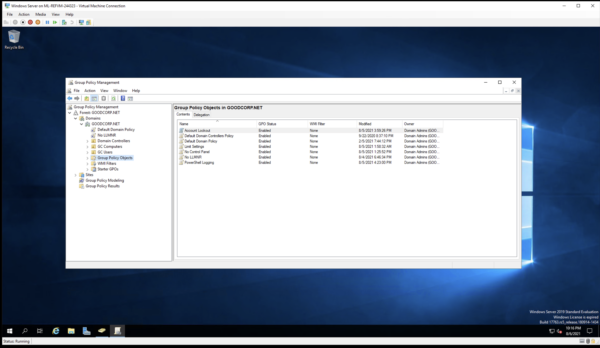
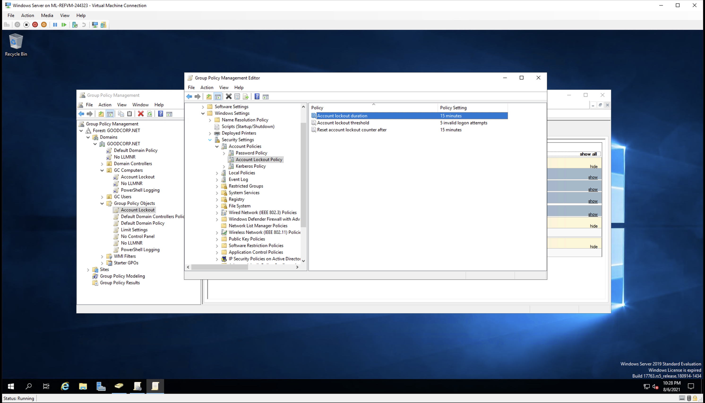
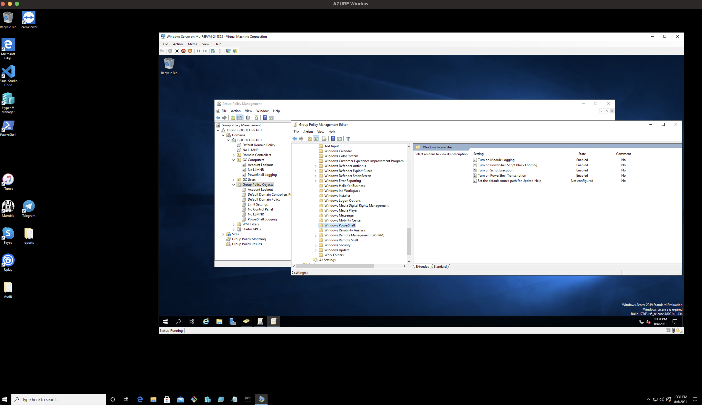
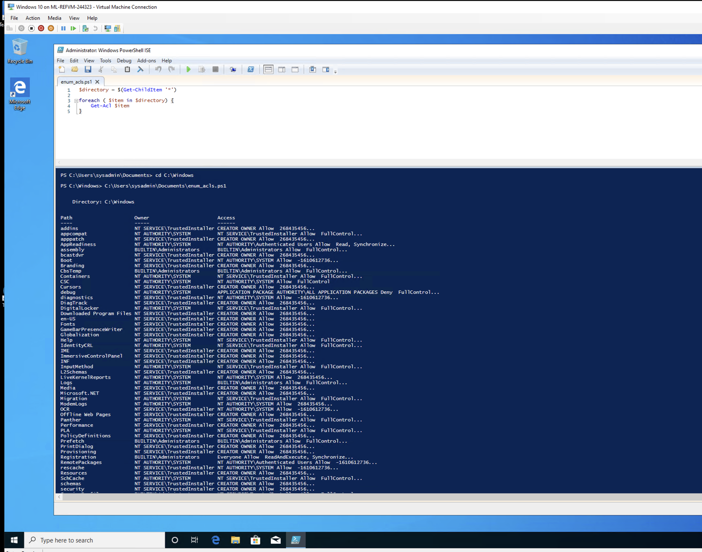
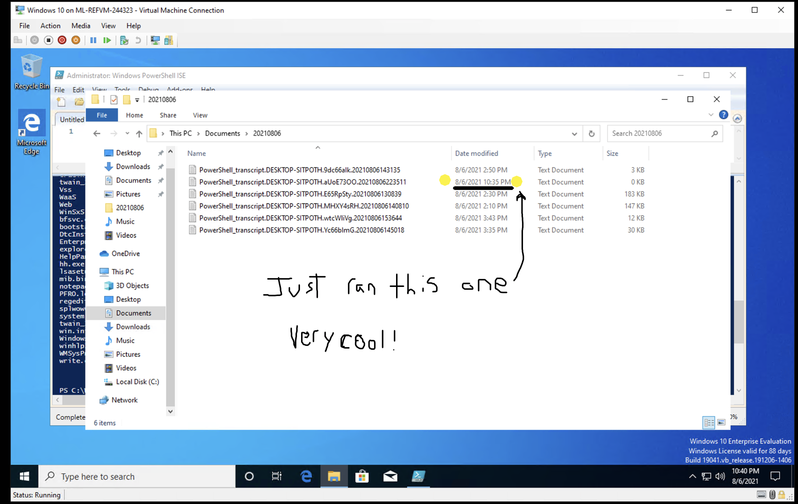

Submission Guidelines
Provide the following:

Deliverable for Task 1: Take a screenshot of all the GPOs created for this homework assignment. To find these, launch the Group Policy Management tool, select Group Policy Objects, and take a screenshot of the GPOs you've created.

Deliverable for Task 2: Submit a screenshot of the different Account Lockout policies in Group Policy Management Editor. It should show the three values you set under the Policy and Policy Setting columns.

Deliverable for Task 3: Submit a screenshot of the different Windows PowerShell policies within the Group Policy Management Editor. Four of these should be enabled.

Deliverable for Task 4: Submit a copy of your enum_acls.ps1 script.

Deliverable for Bonus Task 5: Submit a screenshot of the contents of one of your transcribed PowerShell logs or a copy of one of the logs.

 
#############################################
 
A copy of my powershell script below.

**********************
Windows PowerShell transcript start
Start time: 20210806223516
Username: DESKTOP-SITPOTH\sysadmin
RunAs User: DESKTOP-SITPOTH\sysadmin
Configuration Name: 
Machine: DESKTOP-SITPOTH (Microsoft Windows NT 10.0.19041.0)
Host Application: C:\Windows\system32\WindowsPowerShell\v1.0\PowerShell_ISE.exe
Process ID: 7844
PSVersion: 5.1.19041.1
PSEdition: Desktop
PSCompatibleVersions: 1.0, 2.0, 3.0, 4.0, 5.0, 5.1.19041.1
BuildVersion: 10.0.19041.1
CLRVersion: 4.0.30319.42000
WSManStackVersion: 3.0
PSRemotingProtocolVersion: 2.3
SerializationVersion: 1.1.0.1
**********************
**********************
Command start time: 20210806223516
**********************
PS>[Microsoft.Windows.PowerShell.Gui.Internal.HostTextWriter]::RegisterHost($host.ui)
**********************
Command start time: 20210806223517
**********************
PS>filter more { $_ }
**********************
Command start time: 20210806223517
**********************
PS>
function psEdit([Parameter(Mandatory=$true)]$filenames)
{
    foreach ($filename in $filenames)
    {
        dir $filename | where {!$_.PSIsContainer} | %{
            $psISE.CurrentPowerShellTab.Files.Add($_.FullName) > $null
        }
    }
}
**********************
Command start time: 20210806223517
**********************
PS>$OutputEncoding = [System.Console]::OutputEncoding
**********************
Command start time: 20210806223517
**********************
PS>ipmo ISE
**********************
Command start time: 20210806223518
**********************
PS>CommandInvocation(Set-Variable): "Set-Variable"
>> ParameterBinding(Set-Variable): name="Name"; value="profile"
>> ParameterBinding(Set-Variable): name="Value"; value="C:\Users\sysadmin\Documents\WindowsPowerShell\Microsoft.PowerShellISE_profile.ps1"
>> ParameterBinding(Set-Variable): name="Option"; value="None"
**********************
Command start time: 20210806223531
**********************
PS C:\Users\sysadmin> cd C:\Windows
**********************
Command start time: 20210806223607
**********************
PS C:\Windows> C:\Users\sysadmin\Documents\enum_acls.ps1

    Directory: C:\Windows

Path                     Owner                       Access
----                     -----                       ------
addins                   NT SERVICE\TrustedInstaller CREATOR OWNER Allow  268435456...
appcompat                NT AUTHORITY\SYSTEM         NT SERVICE\TrustedInstaller Allow  FullControl...
apppatch                 NT SERVICE\TrustedInstaller CREATOR OWNER Allow  268435456...
AppReadiness             NT AUTHORITY\SYSTEM         NT AUTHORITY\Authenticated Users Allow  Read, Synchronize...
assembly                 BUILTIN\Administrators      BUILTIN\Administrators Allow  FullControl...
bcastdvr                 NT SERVICE\TrustedInstaller CREATOR OWNER Allow  268435456...
Boot                     NT SERVICE\TrustedInstaller NT AUTHORITY\SYSTEM Allow  -1610612736...
Branding                 NT SERVICE\TrustedInstaller CREATOR OWNER Allow  268435456...
CbsTemp                  BUILTIN\Administrators      BUILTIN\Administrators Allow  FullControl...
Containers               NT AUTHORITY\SYSTEM         NT SERVICE\TrustedInstaller Allow  FullControl...
CSC                      NT AUTHORITY\SYSTEM         NT AUTHORITY\SYSTEM Allow  FullControl
Cursors                  NT SERVICE\TrustedInstaller CREATOR OWNER Allow  268435456...
debug                    NT AUTHORITY\SYSTEM         APPLICATION PACKAGE AUTHORITY\ALL APPLICATION PACKAGES Deny  FullControl...
diagnostics              NT SERVICE\TrustedInstaller NT AUTHORITY\SYSTEM Allow  -1610612736...
DiagTrack                NT SERVICE\TrustedInstaller CREATOR OWNER Allow  268435456...
DigitalLocker            NT AUTHORITY\SYSTEM         NT SERVICE\TrustedInstaller Allow  FullControl...
Downloaded Program Files NT SERVICE\TrustedInstaller CREATOR OWNER Allow  268435456...
en-US                    NT SERVICE\TrustedInstaller CREATOR OWNER Allow  268435456...
Fonts                    NT SERVICE\TrustedInstaller CREATOR OWNER Allow  268435456...
GameBarPresenceWriter    NT SERVICE\TrustedInstaller CREATOR OWNER Allow  268435456...
Globalization            NT SERVICE\TrustedInstaller CREATOR OWNER Allow  268435456...
Help                     NT AUTHORITY\SYSTEM         NT SERVICE\TrustedInstaller Allow  FullControl...
IdentityCRL              NT AUTHORITY\SYSTEM         NT SERVICE\TrustedInstaller Allow  FullControl...
IME                      NT SERVICE\TrustedInstaller CREATOR OWNER Allow  268435456...
ImmersiveControlPanel    NT SERVICE\TrustedInstaller CREATOR OWNER Allow  268435456...
INF                      NT SERVICE\TrustedInstaller CREATOR OWNER Allow  268435456...
InputMethod              NT AUTHORITY\SYSTEM         NT SERVICE\TrustedInstaller Allow  FullControl...
L2Schemas                NT SERVICE\TrustedInstaller CREATOR OWNER Allow  268435456...
LiveKernelReports        NT AUTHORITY\SYSTEM         NT AUTHORITY\SYSTEM Allow  268435456...
Logs                     NT AUTHORITY\SYSTEM         BUILTIN\Administrators Allow  FullControl...
Media                    NT SERVICE\TrustedInstaller CREATOR OWNER Allow  268435456...
Microsoft.NET            NT SERVICE\TrustedInstaller CREATOR OWNER Allow  268435456...
Migration                NT AUTHORITY\SYSTEM         NT SERVICE\TrustedInstaller Allow  FullControl...
ModemLogs                NT AUTHORITY\SYSTEM         NT AUTHORITY\SYSTEM Allow  268435456...
OCR                      NT SERVICE\TrustedInstaller NT AUTHORITY\SYSTEM Allow  -1610612736...
Offline Web Pages        NT SERVICE\TrustedInstaller CREATOR OWNER Allow  268435456...
Panther                  NT AUTHORITY\SYSTEM         NT SERVICE\TrustedInstaller Allow  FullControl...
Performance              NT SERVICE\TrustedInstaller CREATOR OWNER Allow  268435456...
PLA                      NT AUTHORITY\SYSTEM         NT SERVICE\TrustedInstaller Allow  FullControl...
PolicyDefinitions        NT SERVICE\TrustedInstaller CREATOR OWNER Allow  268435456...
Prefetch                 BUILTIN\Administrators      BUILTIN\Administrators Allow  FullControl...
PrintDialog              NT SERVICE\TrustedInstaller CREATOR OWNER Allow  268435456...
Provisioning             NT SERVICE\TrustedInstaller CREATOR OWNER Allow  268435456...
Registration             BUILTIN\Administrators      Everyone Allow  ReadAndExecute, Synchronize...
RemotePackages           NT AUTHORITY\SYSTEM         NT AUTHORITY\Authenticated Users Allow  -1610612736...
rescache                 NT SERVICE\TrustedInstaller NT AUTHORITY\SYSTEM Allow  -1610612736...
Resources                NT SERVICE\TrustedInstaller CREATOR OWNER Allow  268435456...
SchCache                 NT AUTHORITY\SYSTEM         NT SERVICE\TrustedInstaller Allow  FullControl...
schemas                  NT SERVICE\TrustedInstaller CREATOR OWNER Allow  268435456...
security                 NT SERVICE\TrustedInstaller CREATOR OWNER Allow  268435456...
ServiceProfiles          BUILTIN\Administrators      NT SERVICE\TrustedInstaller Allow  FullControl...
ServiceState             NT AUTHORITY\SYSTEM         NT AUTHORITY\SERVICE Allow  ExecuteFile...
servicing                NT SERVICE\TrustedInstaller NT AUTHORITY\SYSTEM Allow  -1610612736...
Setup                    BUILTIN\Administrators      NT SERVICE\TrustedInstaller Allow  FullControl...
ShellComponents          NT SERVICE\TrustedInstaller CREATOR OWNER Allow  268435456...
ShellExperiences         NT SERVICE\TrustedInstaller CREATOR OWNER Allow  268435456...
SKB                      NT SERVICE\TrustedInstaller CREATOR OWNER Allow  268435456...
SoftwareDistribution     NT AUTHORITY\SYSTEM         NT SERVICE\TrustedInstaller Allow  FullControl...
Speech                   NT SERVICE\TrustedInstaller CREATOR OWNER Allow  268435456...
Speech_OneCore           NT SERVICE\TrustedInstaller CREATOR OWNER Allow  268435456...
System                   NT SERVICE\TrustedInstaller CREATOR OWNER Allow  268435456...
System32                 NT SERVICE\TrustedInstaller CREATOR OWNER Allow  268435456...
SystemApps               NT AUTHORITY\SYSTEM         NT SERVICE\TrustedInstaller Allow  FullControl...
SystemResources          NT SERVICE\TrustedInstaller NT AUTHORITY\SYSTEM Allow  -1610612736...
SysWOW64                 NT SERVICE\TrustedInstaller CREATOR OWNER Allow  268435456...
TAPI                     NT AUTHORITY\SYSTEM         NT AUTHORITY\SYSTEM Allow  268435456...
Tasks                    NT AUTHORITY\SYSTEM         CREATOR OWNER Allow  268435456...
Temp                     NT AUTHORITY\SYSTEM         CREATOR OWNER Allow  268435456...
tracing                  NT AUTHORITY\SYSTEM         NT AUTHORITY\SYSTEM Allow  FullControl...
twain_32                 NT SERVICE\TrustedInstaller CREATOR OWNER Allow  268435456...
Vss                      NT AUTHORITY\SYSTEM         NT AUTHORITY\LOCAL SERVICE Allow  FullControl...
WaaS                     NT SERVICE\TrustedInstaller NT AUTHORITY\SYSTEM Allow  -1610612736...
Web                      NT SERVICE\TrustedInstaller CREATOR OWNER Allow  268435456...
WinSxS                   NT SERVICE\TrustedInstaller NT AUTHORITY\SYSTEM Allow  -1610612736...
bfsvc.exe                NT SERVICE\TrustedInstaller NT AUTHORITY\SYSTEM Allow  ReadAndExecute, Synchronize...
bootstat.dat             NT AUTHORITY\SYSTEM         NT AUTHORITY\SYSTEM Allow  FullControl...
DtcInstall.log           BUILTIN\Administrators      BUILTIN\Administrators Allow  FullControl...
EnterpriseEval.xml       BUILTIN\Administrators      NT AUTHORITY\SYSTEM Allow  FullControl...
explorer.exe             NT SERVICE\TrustedInstaller NT AUTHORITY\SYSTEM Allow  ReadAndExecute, Synchronize...
HelpPane.exe             NT SERVICE\TrustedInstaller NT AUTHORITY\SYSTEM Allow  ReadAndExecute, Synchronize...
hh.exe                   NT SERVICE\TrustedInstaller NT AUTHORITY\SYSTEM Allow  ReadAndExecute, Synchronize...
lsasetup.log             BUILTIN\Administrators      NT AUTHORITY\SYSTEM Allow  FullControl...
mib.bin                  NT SERVICE\TrustedInstaller NT AUTHORITY\SYSTEM Allow  ReadAndExecute, Synchronize...
notepad.exe              NT SERVICE\TrustedInstaller NT AUTHORITY\SYSTEM Allow  ReadAndExecute, Synchronize...
PFRO.log                 BUILTIN\Administrators      NT AUTHORITY\SYSTEM Allow  FullControl...
regedit.exe              NT SERVICE\TrustedInstaller NT AUTHORITY\SYSTEM Allow  ReadAndExecute, Synchronize...
splwow64.exe             NT SERVICE\TrustedInstaller NT AUTHORITY\SYSTEM Allow  ReadAndExecute, Synchronize...
system.ini               NT AUTHORITY\SYSTEM         NT AUTHORITY\SYSTEM Allow  FullControl...
twain_32.dll             NT SERVICE\TrustedInstaller NT AUTHORITY\SYSTEM Allow  ReadAndExecute, Synchronize...
win.ini                  NT AUTHORITY\SYSTEM         NT AUTHORITY\SYSTEM Allow  FullControl...
WindowsUpdate.log        NT AUTHORITY\SYSTEM         NT AUTHORITY\SYSTEM Allow  FullControl...
winhlp32.exe             NT SERVICE\TrustedInstaller NT AUTHORITY\SYSTEM Allow  ReadAndExecute, Synchronize...
WMSysPr9.prx             NT SERVICE\TrustedInstaller NT AUTHORITY\SYSTEM Allow  ReadAndExecute, Synchronize...
write.exe                NT SERVICE\TrustedInstaller NT AUTHORITY\SYSTEM Allow  ReadAndExecute, Synchronize...

