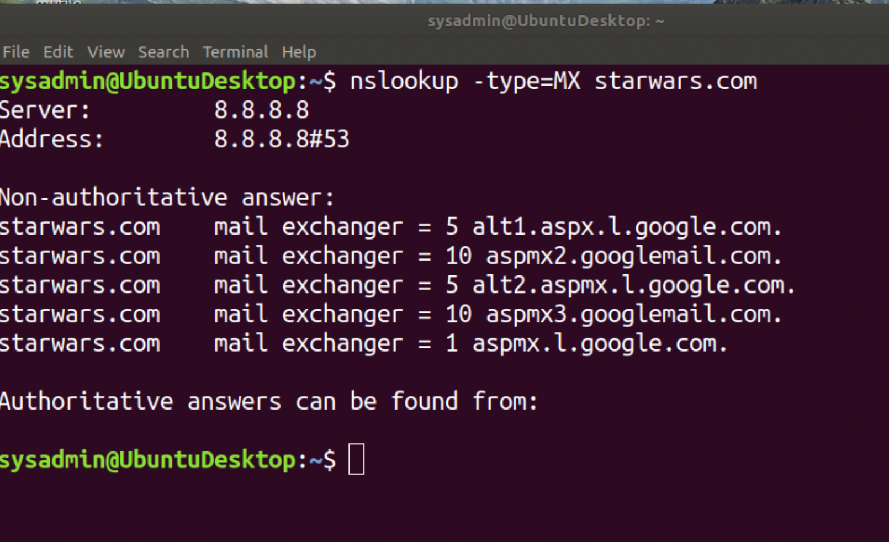
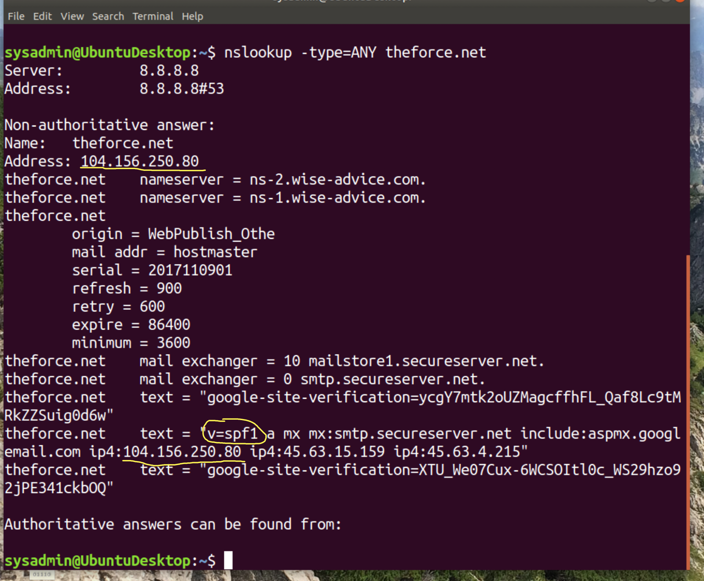
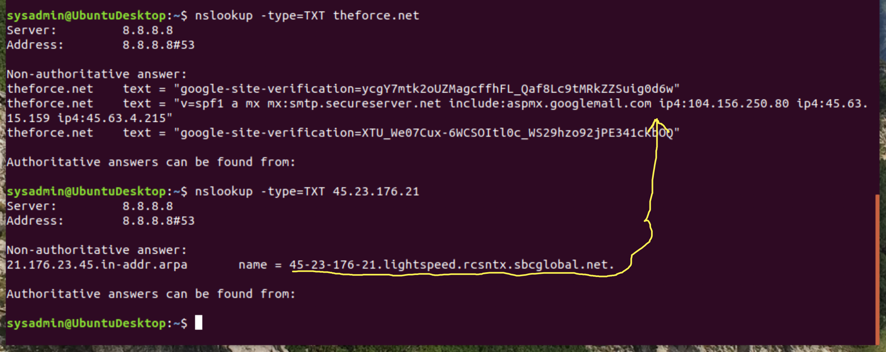
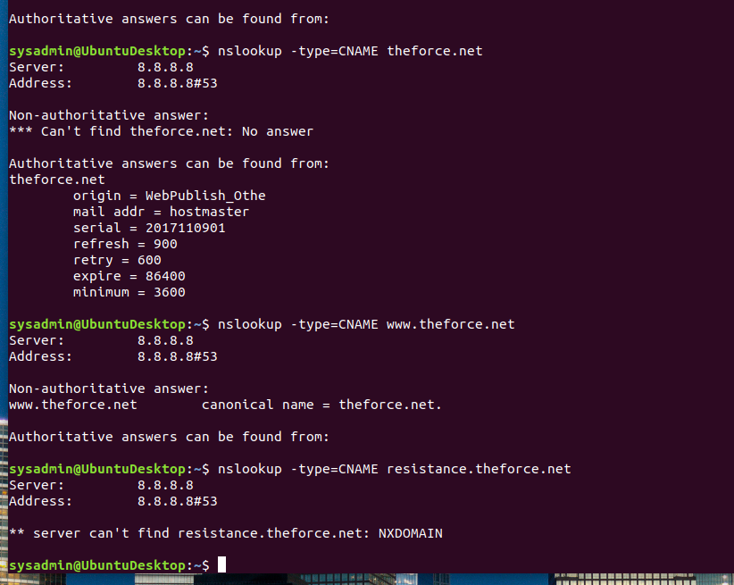
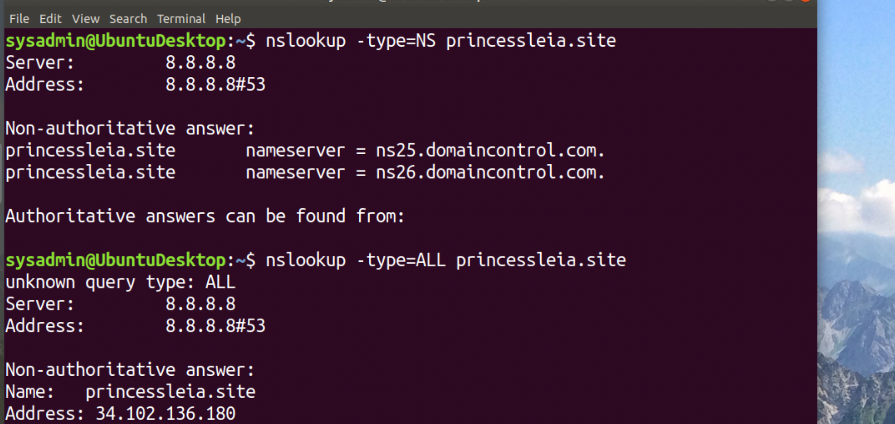
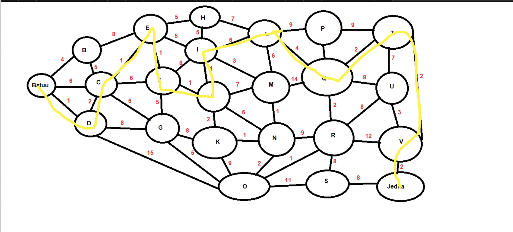
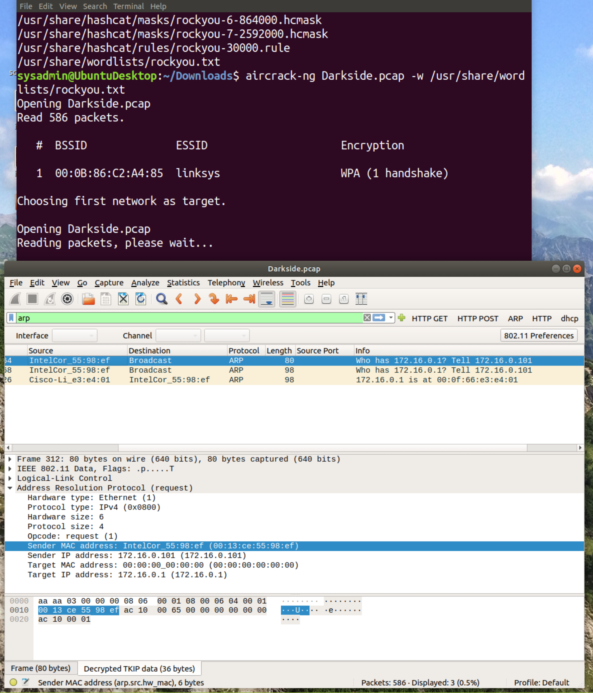
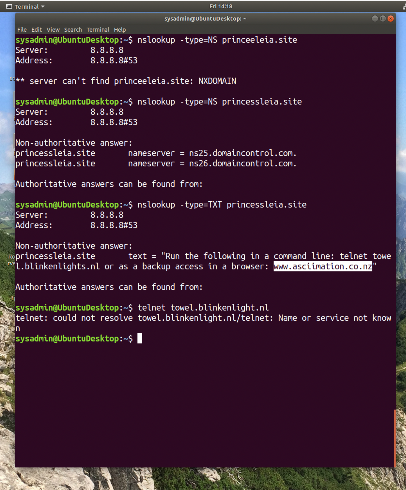
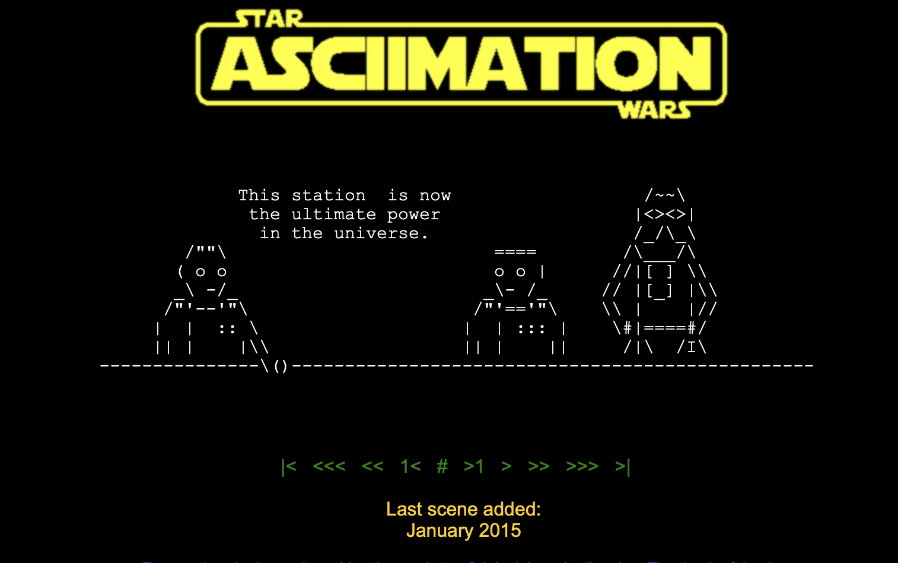

Mission 1
Issue: Due to the DoS attack, the Empire took down the Resistance's DNS and primary email servers.

The Resistance's network team was able to build and deploy a new DNS server and mail server.

The new primary mail server is asltx.l.google.com and the secondary should be asltx.2.google.com.

The Resistance (starwars.com) is able to send emails but unable to receive any.

Your mission:

Determine and document the mail servers for starwars.com using NSLOOKUP.

Explain why the Resistance isn't receiving any emails.

    ## The asltx.l.google.com and asltx.2.l.google.com are not on the list. due to the Dos attack the 2 primary mailservers were shut down. 

Document what a corrected DNS record should be.

    Add them to the list so they get put into the cache for later use. With them added to the list its easier and quicker to get to web site. They may need to update the MX server so they can communicate.     
    ## starwars.com	mail exchanger = 5 asltx.1.google.com.
    ## starwars.com	mail exchanger = 1 asltx.2.l.google.com.
    ## starwars.com	mail exchanger = 10 aspmx3.googlemail.com.
    ## starwars.com	mail exchanger = 5 alt1.aspx.l.google.com.
    ## starwars.com	mail exchanger = 1 aspmx.l.google.com.
    ## starwars.com	mail exchanger = 5 alt2.aspmx.l.google.com.
    ## starwars.com	mail exchanger = 10 aspmx2.googlemail.com.

Mission 2
Issue: Now that you've addressed the mail servers, all emails are coming through. However, users are still reporting that they haven't received mail from the theforce.net alert bulletins.

Many of the alert bulletins are being blocked or going into spam folders.

This is probably due to the fact that theforce.net changed the IP address of their mail server to 45.23.176.21 while your network was down.

These alerts are critical to identify pending attacks from the Empire.

Your mission:

Determine and document the SPF for theforce.net using NSLOOKUP.

 

Explain why the Force's emails are going to spam.

    ## They do not have the 45.23.176.21 in the spf protocol.

Document what a corrected DNS record should be.

    ## This would be done by adding the temp IP address 45.23.176.21 

Mission 3
Issue: You have successfully resolved all email issues and the resistance can now receive alert bulletins. However, the Resistance is unable to easily read the details of alert bulletins online.

They are supposed to be automatically redirected from their sub page of resistance.theforce.net  to theforce.net.

Your mission:

Document how a CNAME should look by viewing the CNAME of www.theforce.net using NSLOOKUP.

Explain why the sub page of resistance.theforce.net isn't redirecting to theforce.net.

    ## The domain name can not have a leading word that is not in the original domain name like www.theforce.net. The reason its not redirecting is because the reference is not there. 

Document what a corrected DNS record should be.

    ## you would have to refer the resistance.theforce.net donaim to the other www.theforce.net best practice to have this. People not using the www is a lazy. 

    

     

Mission 4
Issue: During the attack, it was determined that the Empire also took down the primary DNS server of princessleia.site.

Fortunately, the DNS server for princessleia.site is backed up and functioning.

However, the Resistance was unable to access this important site during the attacks and now they need you to prevent this from happening again.

The Resistance's networking team provided you with a backup DNS server of: ns2.galaxybackup.com.

Your mission:

Confirm the DNS records for princessleia.site.

    ## The ns2.galaxybackup.com is not in the list

Document how you would fix the DNS record to prevent this issue from happening again.

    ## By adding ns2.galaxybackup.com to the list would get the DNS record.

    
    

Mission 5
Issue: The network traffic from the planet of Batuu to the planet of  Jedha is very slow.

You have been provided a network map with a list of planets connected between Batuu and Jedha.

It has been determined that the slowness is due to the Empire attacking Planet N.

Your Mission:

View the Galaxy Network Map and determine the OSPF shortest path from Batuu to Jedha.

Confirm your path doesn't include Planet N in its route.

    ## from Batuu=1 to D=2 to C=1 to E=1 to F=1 to J=1 to I=6 to L=4 to Q=2 to T=2 to V=2 to Jedha

Document this shortest path so it can be used by the Resistance to develop a static route to improve the traffic.

    

Mission 6
Issue: Due to all these attacks, the Resistance is determined to seek revenge for the damage the Empire has caused.

You are tasked with gathering secret information from the Dark Side network servers that can be used to launch network attacks against the Empire.

You have captured some of the Dark Side's encrypted wireless internet traffic in the following pcap: Darkside.pcap.

Your Mission:

Figure out the Dark Side's secret wireless key by using Aircrack-ng.

    ## dictionary
    ## 5df920b5481ed70538dd5fd02423d7e2522205feeebb974cad08a52b5613ede2

Hint: This is a more challenging encrypted wireless traffic using WPA.

In order to decrypt, you will need to use a wordlist (-w) such as rockyou.txt.

    ## MAC 00:13:ce:55:98:ef
    ## IP 172.16.0.101

Use the Dark Side's key to decrypt the wireless traffic in Wireshark.

Hint: The format for they key to decrypt wireless is <Wireless_key>:<SSID>.

Once you have decrypted the traffic, figure out the following Dark Side information:

Host IP Addresses and MAC Addresses by looking at the decrypted ARP traffic.

Document these IP and MAC Addresses, as the resistance will use these IP addresses to launch a retaliatory attack.

Mission 7
As a thank you for saving the galaxy, the Resistance wants to send you a secret message!
Your Mission:

View the DNS record from Mission #4.

The Resistance provided you with a hidden message in the TXT record, with several steps to follow.

Follow the steps from the TXT record.

Note: A backup option is provided in the TXT record (as a website) in case the main telnet site is unavailable

Take a screen shot of the results.

Conclusion

Submit your results and findings from every mission.

    

Congratulations, you have completed your mission and saved the Galaxy!