## Unit 11 Submission File: Network Security Homework 

### Part 1: Review Questions 

#### Security Control Types

The concept of defense in depth can be broken down into three different security control types. Identify the security control type of each set  of defense tactics.

1. Walls, bollards, fences, guard dogs, cameras, and lighting are what type of security control?

    Answer: 
    
            Walls Bollards and such are physical sructures to protect data and cameras and sensors are physical devices put in place to monitor data.

2. Security awareness programs, BYOD policies, and ethical hiring practices are what type of security control?

    Answer: 
    
            these can be put in a policy for acceptable use and for the organization's security policy. 
            managers should make all decissions and control business operations. 
            all personal devices need to be registered with the IT team. IT admistrators have the right to the level of access for each personal device.

3. Encryption, biometric fingerprint readers, firewalls, endpoint security, and intrusion detection systems are what type of security control?

    Answer: 
    
            These are things used to improve security such as software and hardware between you and the internet, 
            like they say the weakest link is between the chair and keyboard right. 
            So basically all these keys, 
            readers and firewalls are used in the technical side of admistration of network management. 
            This would need to be handled by proffesionals and highly skilled actors. 

#### Intrusion Detection and Attack indicators

1. What's the difference between an IDS and an IPS?

    Answer: 
    
            IPS system will accept and reject packets based on rules and IDS systems monitors things and does not do things on it's own. 
            IPS rquires data bases to be updated regulary and IDS needs someone human to sift thru the BS. 
            Basically IPS is more automated and less babysitting and IDS needs to be babysat and monitored. 

2. What's the difference between an Indicator of Attack and an Indicator of Compromise?

   Answer: 
   
        IOC's are used after the crime while IOA's are used in real time while the crime is being committed. 

#### The Cyber Kill Chain

Name each of the seven stages for the Cyber Kill chain and provide a brief example of each.

1. Stage 1: 

        Reconnaissance: The actor gains as much info as possible before really kicking ur ass. 

2. Stage 2: 

        Weaponization: Release the zombie army. 
        Botnets, DDOS and malware are all things you don't want or need. Time bombs and flooding my system no thanks.  

3. Stage 3: 

        Delivery: Close all the ports man they coming in and we don't even know it. 
        Oh by the way I went fishing to day caught a few crappies but I was looking for the big Whale.  

4. Stage 4: 

        Exploitation: Once I have my foot in the door look out cause I'm going to get your passwords, 
        add more undesirable things to your system to slow it down or even crash it. 
        Plus I will take over a lot of commands that you really don't want me to be doing. 

5. Stage 5: 

        Installation: Shut the back door or give me what I want $$$, I can do all of this remotely if ya let me. 
        Ain't playing that bitcoin game either I want cash US crrency please. I got bills to pay. 
        I will get around all your security and lay low. 

6. Stage 6: 

        Command and Control: The beacons HTTP will be allowed a path to inable connectionto download e-keys to take your files. 
        Trojan emailed then contacts server, 
        spyware gets installed then data is stolenand leave organization. A wicked hand shake.  

7. Stage 7: 

        Actions: This can be done many ways filtering data to decrypting files. Comes down to how the attacker wants it to be like for you in hell. 


#### Snort Rule Analysis

Use the Snort rule to answer the following questions:

Snort Rule #1

```bash
alert tcp $EXTERNAL_NET any -> $HOME_NET 5800:5820 (msg:"ET SCAN Potential VNC Scan 5800-5820"; flags:S,12; threshold: type both, track by_src, count 5, seconds 60; reference:url,doc.emergingthreats.net/2002910; classtype:attempted-recon; sid:2002910; rev:5; metadata:created_at 2010_07_30, updated_at 2010_07_30;)
```

1. Break down the Sort Rule header and explain what is happening.

   Answer: 
   
        The tcp packet alert will detect any source socket such as the port 5800:5820 like mail servers. 
        The VNC scan is optional and can have any type of action you like.


2. What stage of the Cyber Kill Chain does this alert violate?

   Answer: 
   
        Classtype attemped-reconnaissance from above the allows actor to gather info. 

3. What kind of attack is indicated?

   Answer: 
   
        ET SCAN Potential VNC Scan 5800-5820. 

Snort Rule #2

```bash
alert tcp $EXTERNAL_NET $HTTP_PORTS -> $HOME_NET any (msg:"ET POLICY PE EXE or DLL Windows file download HTTP"; flow:established,to_client; flowbits:isnotset,ET.http.binary; flowbits:isnotset,ET.INFO.WindowsUpdate; file_data; content:"MZ"; within:2; byte_jump:4,58,relative,little; content:"PE|00 00|"; distance:-64; within:4; flowbits:set,ET.http.binary; metadata: former_category POLICY; reference:url,doc.emergingthreats.net/bin/view/Main/2018959; classtype:policy-violation; sid:2018959; rev:4; metadata:created_at 2014_08_19, updated_at 2017_02_01;)
```

1. Break down the Sort Rule header and explain what is happening.

   Answer: 
   
        Again TCP packet alert going to any destination socket this could be specific. Options mssages ET policy.  

2. What layer of the Defense in Depth model does this alert violate?

   Answer: 
   
        classtype Policy-violation best practice is to have multiple layers of protection. 
        Ya be careful about putting this in place to prevent thing that may not happen just to make other things being used to be slow or hard to do after you impliment a defence policy. 
        You have to be wise as to what you put in place and balance the outcome. 
        You don't get nothing for free building high fences only slows traffic that may be ok to get thru. 

3. What kind of attack is indicated?

   Answer: 
   
        ET POLICY PE EXE or DLL Windows file download HTTP. 
        Someone downloaded files that they sholdn't have. 
        Using wireshark to detect traffic and looking at it would help. This could be false positive or you are too late and damage is done already. 
        Solution to this would be to tell people this is not allowed to download EXE files and to put it on the blacklist.  

Snort Rule #3

- Your turn! Write a Snort rule that alerts when traffic is detected inbound on port 4444 to the local network on any port. Be sure to include the `msg` in the Rule Option.

    Answer: alert tcp 4444 any -> any (msg: "Web traffic"; content: "login"; sid: 8692649)

### Part 2: "Drop Zone" Lab

#### Log into the Azure `firewalld` machine

Log in using the following credentials:

- Username: `sysadmin`
- Password: `cybersecurity`

#### Uninstall `ufw`

Before getting started, you should verify that you do not have any instances of `ufw` running. This will avoid conflicts with your `firewalld` service. This also ensures that `firewalld` will be your default firewall.

- Run the command that removes any running instance of `ufw`.

    ```bash
    $ sudo apt -y remove ufw
    ```
    <br>

    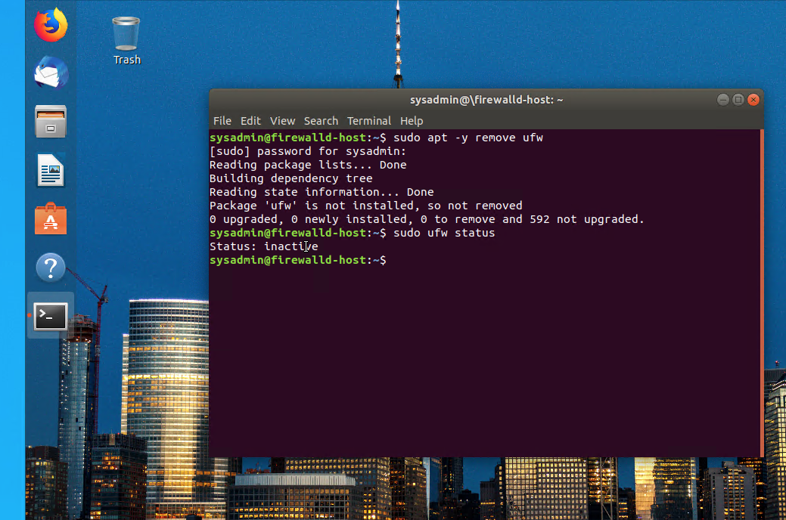

#### Enable and start `firewalld`

By default, these service should be running. If not, then run the following commands:

- Run the commands that enable and start `firewalld` upon boots and reboots.

    ```bash
    $ sudo systemctl enable firewalld
    $ sudo systemctl start firewalld
    ```

  Note: This will ensure that `firewalld` remains active after each reboot.

#### Confirm that the service is running.

- Run the command that checks whether or not the `firewalld` service is up and running.

    ```bash
    $ sudo firewall-cmd --state
    ```
    <br>

    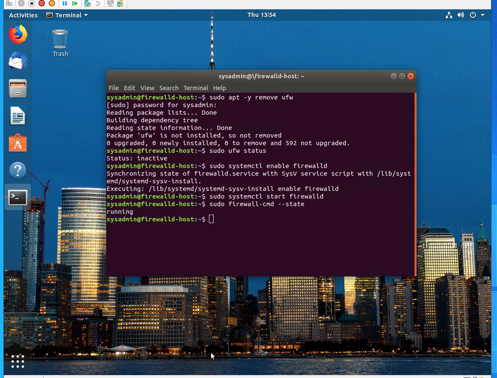


#### List all firewall rules currently configured.

Next, lists all currently configured firewall rules. This will give you a good idea of what's currently configured and save you time in the long run by not doing double work.

- Run the command that lists all currently configured firewall rules:

    ```bash
    $ sudo firewall-cmd --list-all
    ```
    <br>

    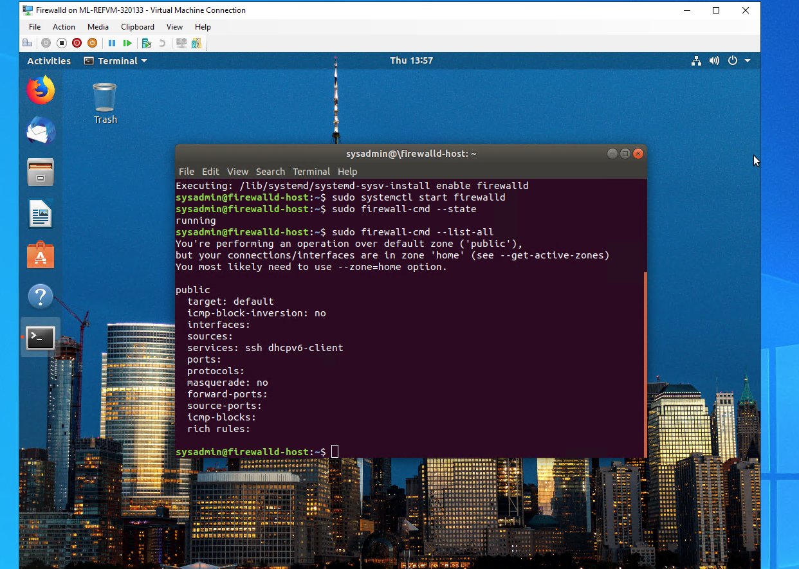

- Take note of what Zones and settings are configured. You many need to remove unneeded services and settings.

#### List all supported service types that can be enabled.

- Run the command that lists all currently supported services to see if the service you need is available

    ```bash
    $ sudo firewall-cmd --get-services
    ```

    <br>

    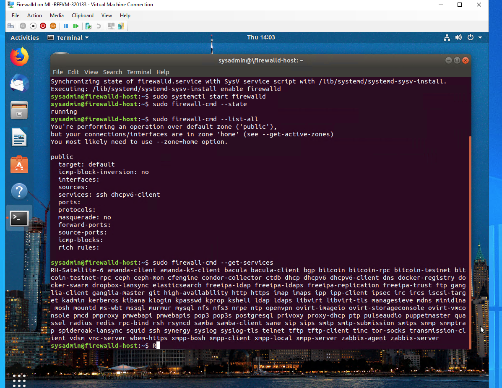

- We can see that the `Home` and `Drop` Zones are created by default.


#### Zone Views

- Run the command that lists all currently configured zones.

    ```bash
    $ sudo firewall-cmd --list-all-zones
    ```

    <br>

    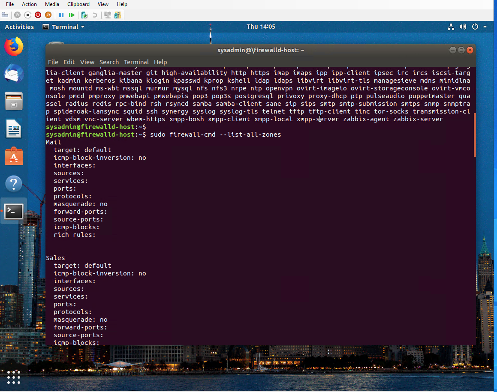

- We can see that the `Public` and `Drop` Zones are created by default. Therefore, we will need to create Zones for `Web`, `Sales`, and `Mail`.

#### Create Zones for `Web`, `Sales` and `Mail`.

- Run the commands that creates Web, Sales and Mail zones.

    ```bash
    $ sudo firewall-cmd --new-zone=Web --permanent
    $ sudo firewall-cmd --new-zone=Sales --permanent
    $ sudo firewall-cmd --new-zone=Mail --permanent
    FYI dont forget to reload by running sudo firewall-cmd --reload and dont forget the --
    Oh and use png not ping for pics lol. 
    ```

    <br>

    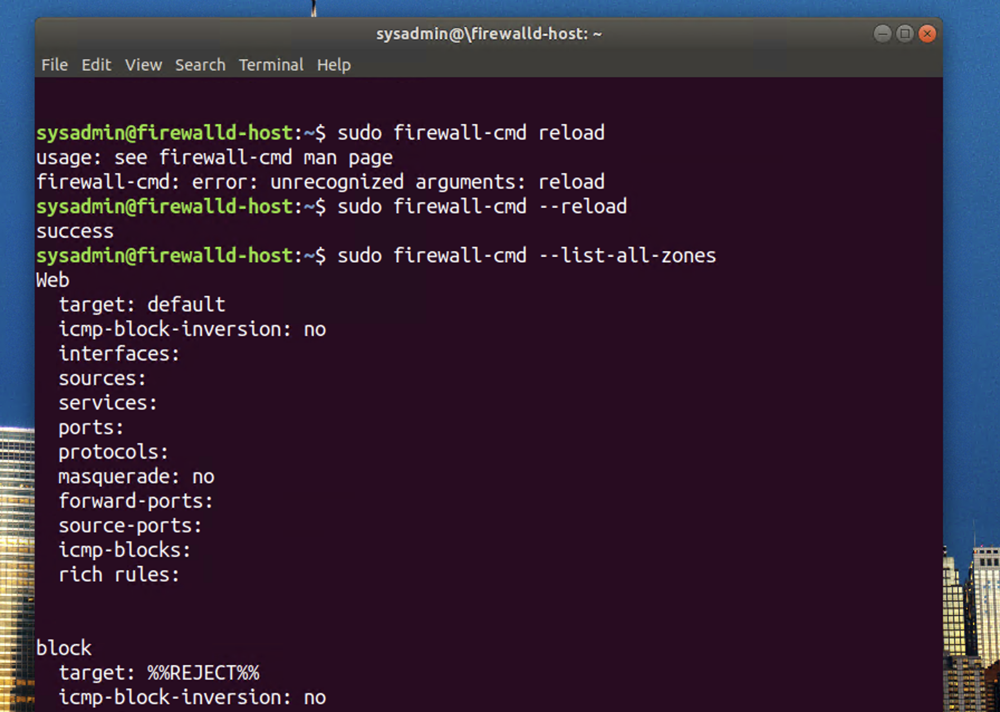

    <br>

    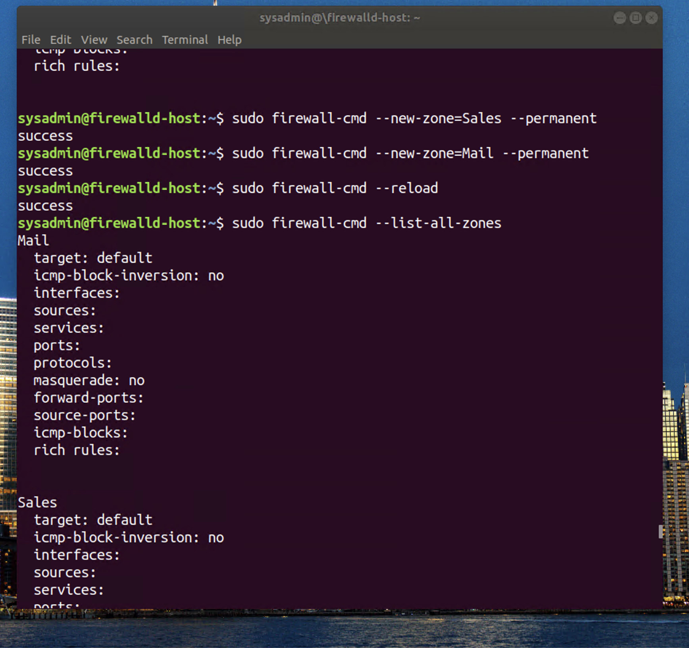

#### Set the zones to their designated interfaces:

- Run the commands that sets your `eth` interfaces to your zones.

    ```bash
    $ sudo firewall-cmd --permanent --zone=public --add-interface=ETH0
    $ sudo firewall-cmd --permanent --zone=Web --add-interface=ETH1
    $ sudo firewall-cmd --permanent --zone=Sales --add-interface=ETH2
    $ sudo firewall-cmd --permanent --zone=Mail --add-interface=ETH3
    ```
    <br>

    

    <br>

    

#### Add services to the active zones:

- Run the commands that add services to the **public** zone, the **web** zone, the **sales** zone, and the **mail** zone.

- Public:

    ```bash
    $ sudo firewall-cmd --permanent --add-service=http --zone=public
    $ sudo firewall-cmd --permanent --add-service=https --zone=public
    $ sudo firewall-cmd --permanent --add-service=smtp --zone=public
    $ sudo firewall-cmd --permanent --add-service=pop3 --zone=public
    ```

- Web:

    ```bash
    $ sudo firewall-cmd --permanent--add-service=http --zone=Web
    ```

- Sales

    ```bash
    $ sudo firewall-cmd --permanent--add-service=https --zone=Sales
    ```

- Mail

    ```bash
    $ sudo firewall-cmd --permanent --add-service=pop3 --zone=Mail
    $ sudo firewall-cmd --permanent --add-service=smtp --zone=Mail
    ```
    <br>

    

    <br>

    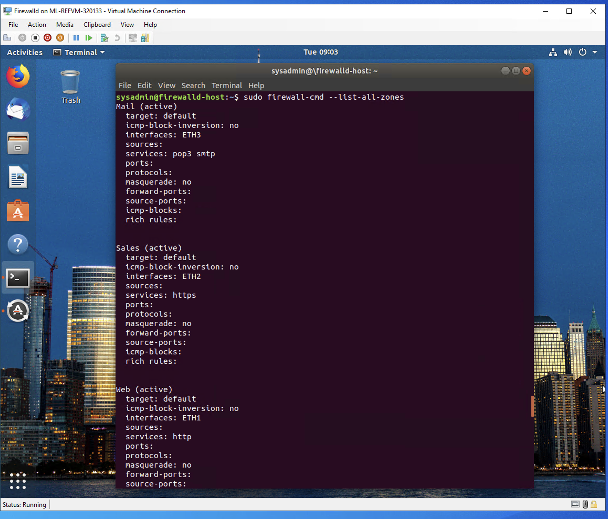

- What is the status of `http`, `https`, `smtp` and `pop3`?      Temporary

#### Add your adversaries to the Drop Zone.

- Run the command that will add all current and any future blacklisted IPs to the Drop Zone.

     ```bash
    $ sudo firewall-cmd --permanent --zone=drop --add-source=10.208.56.23
    $ sudo firewall-cmd --permanent --zone=drop --add-source=135.95.103.76
    $ sudo firewall-cmd --permanent --zone=drop --add-source=76.34.169.118
    ```
    <br>

    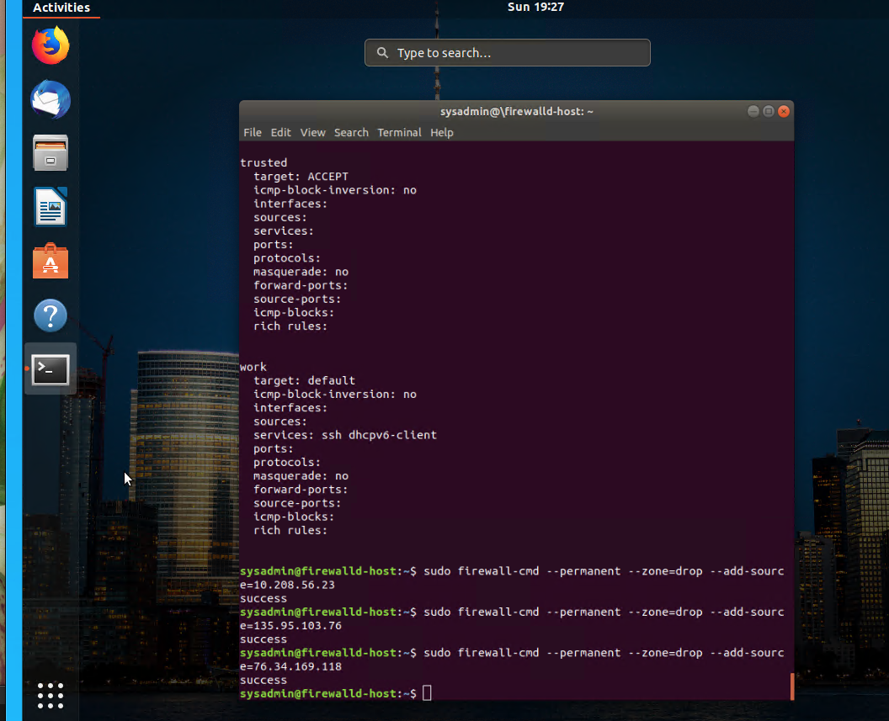

    <br>

    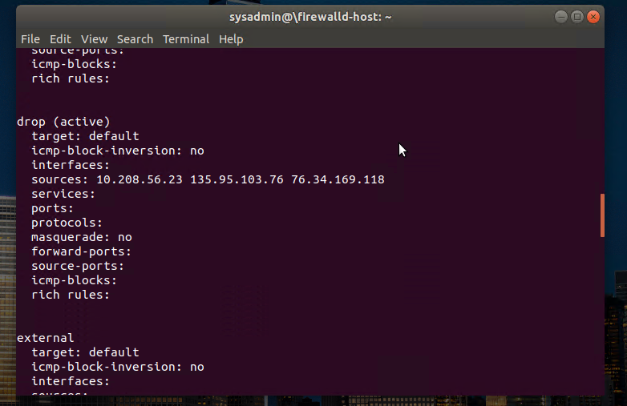

#### Make rules permanent then reload them:

It's good practice to ensure that your `firewalld` installation remains nailed up and retains its services across reboots. This ensure that the network remains secured after unplanned outages such as power failures.

- Run the command that reloads the `firewalld` configurations and writes it to memory

    ```bash
    $ sudo firewall-cmd --reload
    ```

#### View active Zones

Now, we'll want to provide truncated listings of all currently **active** zones. This a good time to verify your zone settings.

- Run the command that displays all zone services.

    ```bash
    $ sudo firewall-cmd --get-active-zones
    ```
    <br>

    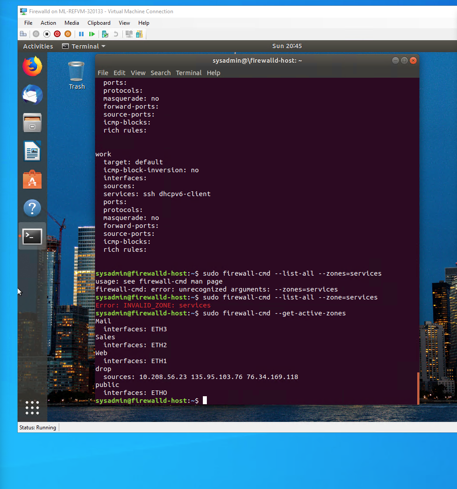


#### Block an IP address

- Use a rich-rule that blocks the IP address `138.138.0.3`.

    ```bash
    $ sudo firewall-cmd --permanent --zone=public --add-rich-rule="rule family='ipv4' source address='138.138.0.3' reject"
    ```
    <br>

    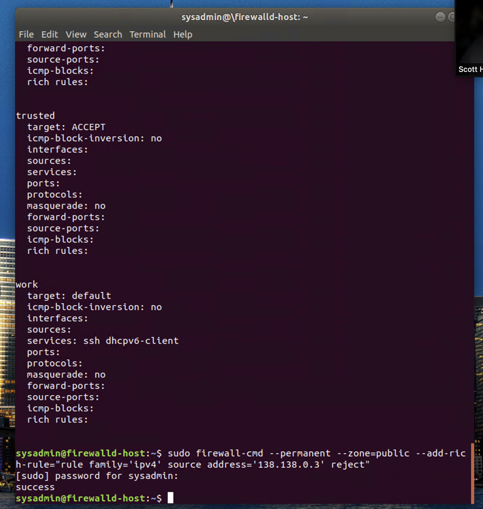

    <br>

    

#### Block Ping/ICMP Requests

Harden your network against `ping` scans by blocking `icmp ehco` replies.

- Run the command that blocks `pings` and `icmp` requests in your `public` zone.

    ```bash
    $ sudo firewall-cmd --zone=public --add-icmp-block=echo-reply --add-icmp-block=echo-request
    ```
    <br>

    

    <br>
    
    

#### Rule Check

Now that you've set up your brand new `firewalld` installation, it's time to verify that all of the settings have taken effect.

- Run the command that lists all  of the rule settings. Do one command at a time for each zone.

    ```bash
    $ sudo firewall-cmd --zone=public --list-all
    $ sudo firewall-cmd --zone=Web --list-all
    $ sudo firewall-cmd --zone=Sales --list-all
    $ sudo firewall-cmd --zone=Mail --list-all
    $ sudo firewall-cmd --zone=drop --list-all
    ```
    <br>

    

    <br>

    

    <br>

    

    <br>

    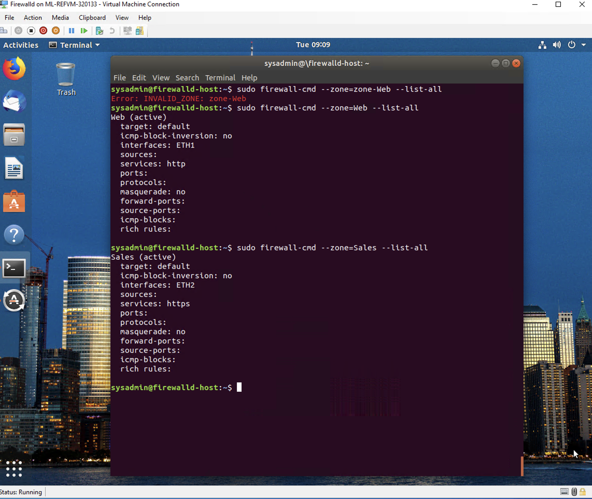


- Are all of our rules in place? If not, then go back and make the necessary modifications before checking again.


Congratulations! You have successfully configured and deployed a fully comprehensive `firewalld` installation.

---

### Part 3: IDS, IPS, DiD and Firewalls

Now, we will work on another lab. Before you start, complete the following review questions.

#### IDS vs. IPS Systems

1. Name and define two ways an IDS connects to a network.

   Answer 1: 
   
        INTRUSION DETECTION SYSTEM
        Signature-based detection uses a unique identifier to detect future attacks bad malware and such. 
        Basically the network promiscuous mode. 
        A network-base uses a NIC card to sniff packets. Much more real time monitoring watching the traffic as it goes accross the network. 
        Not good for many machines because there will be loop holes to get around a specific machine.

   Answer 2: 
   
        Statistical anomaly-based detection relies 
        on comparing anomalies to compare 
        baselines in "good traffic". 
        Basically the host. 
        This monitors a single system. 
        The IDS runs on the host try to find anomalies. 
        Using logs it will be an after the fact monitoring situation.

        It don't matter which we use just know that we are looking for unusual activity, and to be able to know the difference between good and bad data

2. Describe how an IPS connects to a network.

   Answer: 
   
            INTRUSION PREVENTION SYSTEM
            The IPS is inline direct path of source and destination.
            The huge difference is IDS monitors, 
            and will alert or alram you and IPS will stop it before it gets to your network
            

3. What type of IDS compares patterns of traffic to predefined signatures and is unable to detect Zero-Day attacks?

   Answer: 
   
        SNIDS signature-based
            

4. Which type of IDS is beneficial for detecting all suspicious traffic that deviates from the well-known baseline and is excellent at detecting when an attacker probes or sweeps a network?

   Answer: 
   
        Good for detecting suspicious traffic and prone to false alerts. So this will be a anomaly-based IDS.

#### Defense in Depth

1. For each of the following scenarios, provide the layer of Defense in Depth that applies:

    1.  A criminal hacker tailgates an employee through an exterior door into a secured facility, explaining that they forgot their badge at home.

        Answer: 
        
            Physical layer like a access control vestibules. Like a mantrap. 

    2. A zero-day goes undetected by antivirus software.

        Answer: 
        
            Anti virus in an application. So Application layer.

    3. A criminal successfully gains access to HR’s database.

        Answer: 
        
            Data layer

    4. A criminal hacker exploits a vulnerability within an operating system.

        Answer: 
            
            Host because they are looking at the operating system

    5. A hacktivist organization successfully performs a DDoS attack, taking down a government website.

        Answer:
        
            Network service prevention

    6. Data is classified at the wrong classification level.

        Answer:
        
            Data classification also helps an organization comply with relevant industry-specific regulatory mandates such as SOX, HIPAA, PCI DSS, and GDPR. Like procedures and policies.

    7. A state sponsored hacker group successfully firewalked an organization to produce a list of active services on an email server.

        Answer:
        
            Perimeter getting through the firewall.


            
        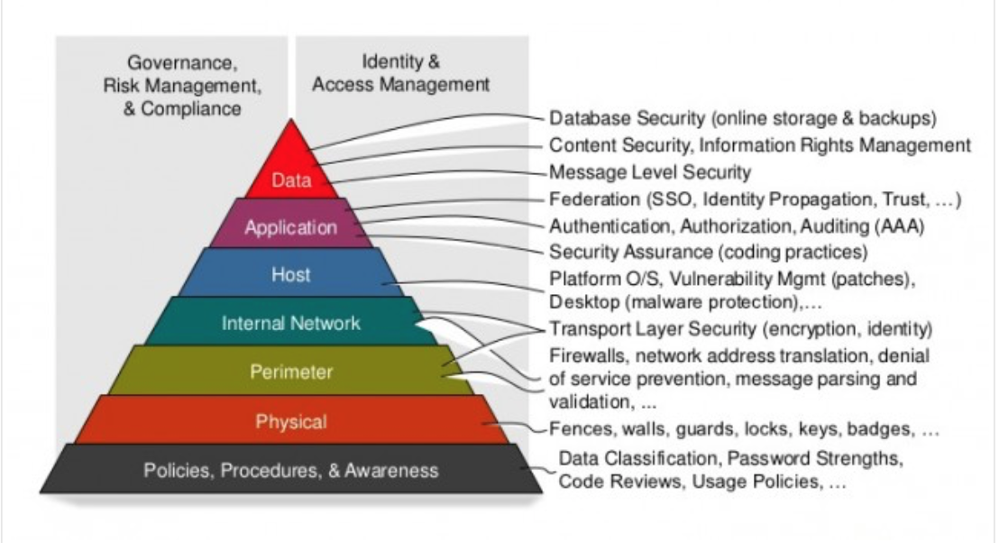

        <br> 

2. Name one method of protecting data-at-rest from being readable on hard drive.

    Answer:
    
        Encrypt hard drives

3. Name one method to protect data-in-transit.

    Answer:
    
        encrypt connections HTTPS, SSL, TLS, FTPS, etc... 
        VPN and spoofers = Spoofing your location is just another term for faking or hiding your location. 
        This requires changing your IP address. 
        One of the easiest ways to spoof your location is to use a VPN. 
        This allows you to connect to a server in another country and obtain a different IP address

4. What technology could provide law enforcement with the ability to track and recover a stolen laptop.

   Answer:
   
        Using GPS or Wi-Fi geolocation, LoJack for Laptops can map and display your laptops current and past whereabouts, 
        so you'll know whether it's simply left behind, or something more serious. Even when your laptop is safe and sound, 
        you can see that LoJack for Laptops is on the job.plus this is really cool Software tokens do have benefits: 
        there is no physical token to carry, 
        they do not contain batteries that will run out, 
        and they are cheaper than hardware tokens.

5. How could you prevent an attacker from booting a stolen laptop using an external hard drive?

    Answer:
    
        Thankfully, you can protect your data against both of these types of attacks with encryption. 
        “Encryption is a mathematical process used to jumble up data. If important files or whole devices are encrypted, there is no way to make sense of them without the key,”. 
        That means if thieves try to access your information, they’ll find only a jumbled mess unless they have your password, 
        and they won’t be able to simply reset that password if the device is encrypted.
        Encrypting your hard drive isn’t some super-technical process that only security experts can perform, 
        either — anyone can do it on his or her computer at home, 
        and it should take only a few minutes to get up and running.


#### Firewall Architectures and Methodologies

1. Which type of firewall verifies the three-way TCP handshake? TCP handshake checks are designed to ensure that session packets are from legitimate sources.

  Answer:
  
    (Circuit-Level Gateways) = As another simplistic firewall type that is meant to quickly and easily approve or deny traffic without consuming significant computing resources, 
    `circuit-level gateways work by verifying the transmission control protocol (TCP) handshake.` 
    This TCP handshake check is designed to make sure that the session the packet is from is legitimate.
    While extremely resource-efficient, 
    these firewalls do not check the packet itself. 
    So, if a packet held malware, but had the right TCP handshake, 
    it would pass right through. 
    This is why (circuit-level gateways) are not enough to protect your business by themselves.

2. Which type of firewall considers the connection as a whole? Meaning, instead of looking at only individual packets, these firewalls look at whole streams of packets at one time.

  Answer:
  
    (Stateless firewalls) are designed to protect networks based on static information such as source and destination. 
    Whereas stateful firewalls filter packets based on the full context of a given network connection, 
    `(stateless firewalls filter packets)` based on the individual packets themselves

3. Which type of firewall intercepts all traffic prior to being forwarded to its final destination. In a sense, these firewalls act on behalf of the recipient by ensuring the traffic is safe prior to forwarding it?

  Answer:
  
    A `(Proxy Server)` responds to input packets and blocks other packets.
    A Proxy Server can be dedicated on a hardware device or as software. A Proxy Server acts as an entry point from one network to another on behalf of the user.  
    This allows for the entry of an internal system from the external network more difficult. 
    `(Proxy Server Firewalls)` can mask the IP address and limit the different traffic types.
    They are protocol-aware which provides security analysis


4. Which type of firewall examines data within a packet as it progresses through a network interface by examining source and destination IP address, port number, and packet type- all without opening the packet to inspect its contents?

  Answer: 
  
    `Packet filtering firewall.` 
    While a packet filtering firewall only examines an individual packet out of context, 
    a stateful firewall is able to watch the traffic over a given connection, 
    generally defined by the source and destination IP addresses, 
    the ports being used, 
    and the already existing network traffic


5. Which type of firewall filters based solely on source and destination MAC address?

  Answer:
  
    `The MAC layer firewall,` or what's known as the `media access control layer firewall,` 
    operates within one of two sublayers within the second layer of the OSI model (the data link layer).
    This allows the firewall to determine whether to block or allow the packets to access the network.


### Bonus Lab: "Green Eggs & SPAM"
In this activity, you will target spam, uncover its whereabouts, and attempt to discover the intent of the attacker.
 
- You will assume the role of a Jr. Security administrator working for the Department of Technology for the State of California.
 
- As a junior administrator, your primary role is to perform the initial triage of alert data: the initial investigation and analysis followed by an escalation of high priority alerts to senior incident handlers for further review.
 
- You will work as part of a Computer and Incident Response Team (CIRT), responsible for compiling **Threat Intelligence** as part of your incident report.

#### Threat Intelligence Card

**Note**: Log into the Security Onion VM and use the following **Indicator of Attack** to complete this portion of the homework. 

Locate the following Indicator of Attack in Sguil based off of the following:

- **Source IP/Port**: `188.124.9.56:80`
- **Destination Address/Port**: `192.168.3.35:1035`
- **Event Message**: `ET TROJAN JS/Nemucod.M.gen downloading EXE payload`

Answer the following:

1. What was the indicator of an attack?
   - Hint: What do the details of the reveal? 

    Answer: 
    
        alert tcp $EXTERNAL_NET_PORTS -> $HOME_NET any. 
        This is a Italian Spam campain using js nemucod. 
        Trying to download a executable file.

    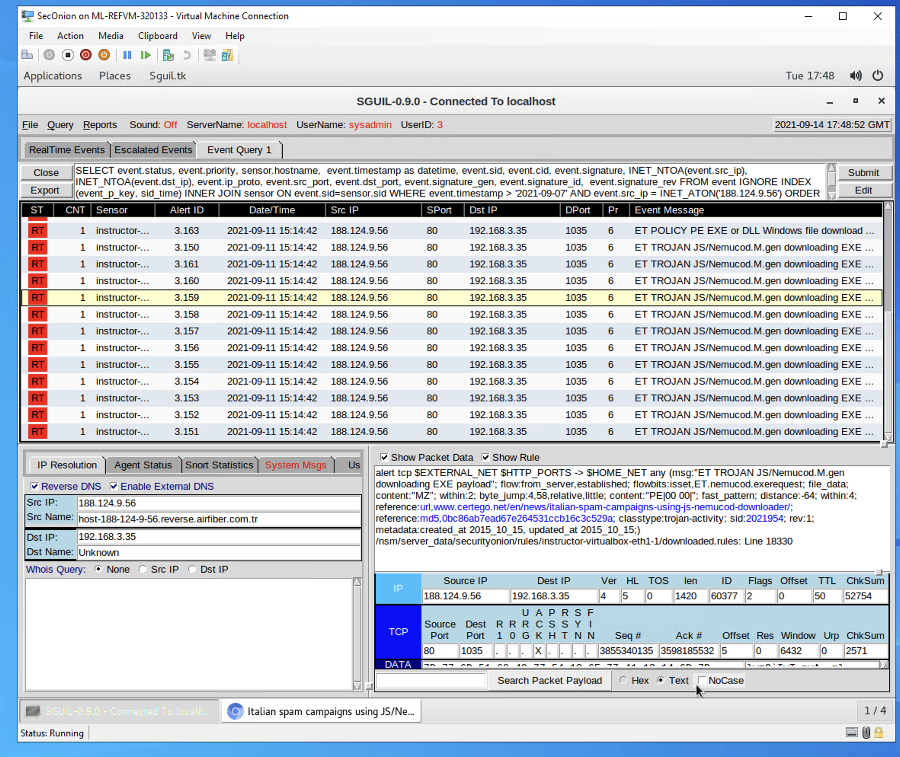


2. What was the adversarial motivation (purpose of attack)?

    Answer: 
    
            TROJAN EXE payload executable. 
            Italian Spam Campain using JS/Nemucod downloader. 
            Getting people to click on the download and get them 
            in the sandbox.This could be a ransomware attack for the decryption tools. 

    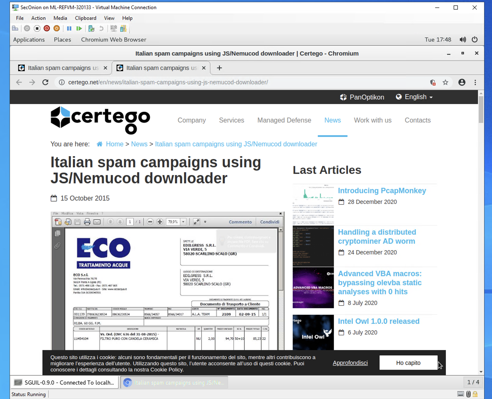

3. Describe observations and indicators that may be related to the perpetrators of the intrusion. Categorize your insights according to the appropriate stage of the cyber kill chain, as structured in the following table.

| TTP | Example | Findings |
| --- | --- | --- | 
| **Reconnaissance** |  How did they attacker locate the victim? | The victims were located using emails, a campain was sent out.
| **Weaponization** |  What was it that was downloaded?| In the email they open the zip file and bam. inside the download were 3 files. WScript,MSXML2.XMLHTTP and ADODB. The malware used the ODDOB to open the decoy PDF file. 
| **Delivery** |    How was it downloaded?| This would save an executable temp file %TEMP% using a decoy to make them open it again in the browser. The EXE file will run in the background. This came as a email and user would open it and because it was a executable javascript. This was installed using a wordpress page.
| **Exploitation** |  What does the exploit do?| Runs in the background. Using WScript.Shell ActiveX control.
| **Installation** | How is the exploit installed?| Javascript that loads a simple EXE file. Making user believe the are looking at a real invoice. 
| **Command & Control (C2)** | How does the attacker gain control of the remote machine?| Connects to the host remotely in order to succeed.
| **Actions on Objectives** | What does the software that the attacker sent do to complete it's tasks?| After reboot a phony home starts. It connects to a remote host to succeed its activities.it may have a few things goig on tho. They can monitor or alter your system settings. your pc will run slow, programs crash, window freezes. 


    Answer:    


4. What are your recommended mitigation strategies?


    Answer: 
    
            Very first thing is lock down the network unplugg shit.
            Isolate that network before it gets real bad. 
             Try anti malware software to get rid of ransomeware executable.
             After the fact you can check for decryption options to get your data back.  
             Don't allow traffic from unwanted sites into your network.


5. List your third-party references.

    Answer: 
    
        Certego

        https://youtu.be/g0yXmQx89x4

        https://www.2-spyware.com/remove-js-nemucod.html 

    
---

© 2020 Trilogy Education Services, a 2U, Inc. brand. All Rights Reserved.