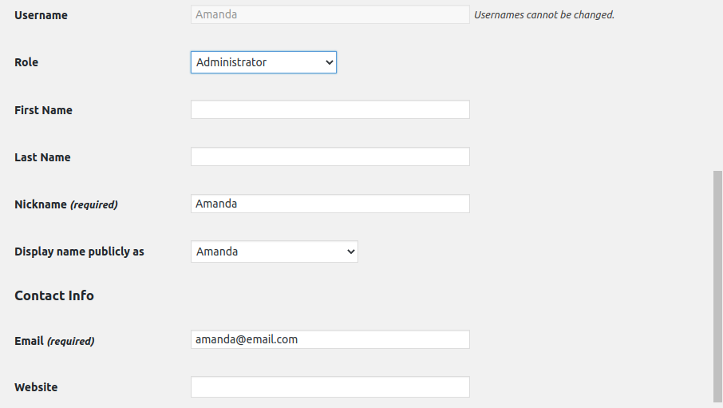

Week 14 Homework: Web Development

Overview
In this homework, we will review the many of the concepts and tools covered in the Web Development unit. If needed, refer to the  reference sheets provided to you.

HTTP Reference Sheet
curl Reference Sheet

Questions
Before you work through the questions below, please create a new file and record your answers there. This will be your homework deliverable.

HTTP Requests and Responses
Answer the following questions about the HTTP request and response process.

### What type of architecture does the HTTP request and response process occur in?

        HTTP request is made then the client waits for the response.The server and client need to be aware of each other during request. So server-client is where the architecture hangs out. HTTP client sends request to server like URL. The server responds with a status line. 
        HTTP is based on the client-server architecture model and a stateless request/response protocol that operates by exchanging messages across a reliable TCP/IP connection. Reference: https://www.tutorialspoint.com/http/http_messages.htm 

### What are the different parts of an HTTP request?

                A Request-line.
                Zero or more header.
                An empty line.
                Optional message body.
                Reference:
                https://www.tutorialspoint.com/http/http_requests.htm 

### Which part of an HTTP request is optional?

        Optional message body. The message body part is optional for an HTTP request.

### What are the three parts of an HTTP response?

                A status line.
                Zero or more headers.
                An empty line.
                Optional message body but usually needed.
                Reference:
                https://www.tutorialspoint.com/http/http_responses.htm 

### Which number class of status codes represents errors?

        400 and up for Client errors.
        500  and up for Server errors.
              I see a lot of 404 lol. 

### What are the two most common request methods that a security professional will encounter?

        GET and POST are by far the most common methods. Case sensitive also fyi.Most Dev'sdo not know or consider the implication of these two security features in their code. 
        Reference:
        https://owasp.org/www-project-web-security-testing-guide/latest/        4-Web_Application_Security_Testing/     02-Configuration_and_Deployment_Management_Testing/06-Test_HTTP_Methods

### Which type of HTTP request method is used for sending data?

        The POST method is used when you want to send some data to the server.

### Which part of an HTTP request contains the data being sent to the server?

        The final request is the body. This request may send data to the server. 

### In which part of an HTTP response does the browser receive the web code to generate and style a web page?

        Ths would be done in the body response and the css for style, I believe. Unless you are asking for the index.html file.

### Using curl
### Answer the following questions about curl:

### What are the advantages of using curl over the browser?

        Curl is free and free is good lol. Curl is used for complex tasks and is flexable in its ability to transfer data to and from a server. 

### Which curl option is used to change the request method?

        You can tell curl to change methods with -X or --request in the command line. 

### Which curl option is used to set request headers?

        -H --header Don't Use this unless you know what you are doing. 

### Which curl option is used to view the response header?

        -I --head gets only the headers. 

### Which request method might an attacker use to figure out which HTTP requests an HTTP server will accept?

Sessions and Cookies
Recall that HTTP servers need to be able to recognize clients from one another. They do this through sessions and cookies.
Answer the following questions about sessions and cookies:

Which response header sends a cookie to the client?
HTTP/1.1 200 OK
Content-type: text/html
Set-Cookie: cart=Bob

        The Set-Cookie: is a response header and used to send cookies from the server to the user agent. HTTP/1.1 200 OK

Which request header will continue the client's session?
GET /cart HTTP/1.1
Host: www.example.org
Cookie: cart=Bob

        I have to go with HTTP keep-alive header here. Heres an example.
         <IfModule mod_headers.c>
	        Header set Connection keep-alive>
	          <IfModule>

Example HTTP Requests and Responses
Look through the following example HTTP request and response and answer the following questions:
HTTP Request
POST /login.php HTTP/1.1
Host: example.com
Accept-Encoding: gzip, deflate, br
Connection: keep-alive
Content-Type: application/x-www-form-urlencoded
Content-Length: 34
Upgrade-Insecure-Requests: 1
User-Agent: Mozilla/5.0 (Linux; Android 6.0; Nexus 5 Build/MRA58N) AppleWebKit/537.36 (KHTML, like Gecko) Chrome/80.0.3987.132 Mobile Safari/537.36

username=Barbara&password=password

What is the request method?

         This is  a POST method

Which header expresses the client's preference for an encrypted response?

        Upgrade-Insecure-Requests: 1
        This is a request type header. It sends a signal to the server expressing the client’s preference for an encrypted and authenticated response, and it can successfully handle the upgrade-insecure-requests HTTP headers Content-Security-Policy directive

Does the request have a user session associated with it?

        Because there is no cookie associated with this one I have to say "NO".

What kind of data is being sent from this request body?

        Username and password. Login information.

HTTP Response
HTTP/1.1 200 OK
Date: Mon, 16 Mar 2020 17:05:43 GMT
Last-Modified: Sat, 01 Feb 2020 00:00:00 GMT
Content-Encoding: gzip
Expires: Fri, 01 May 2020 00:00:00 GMT
Server: Apache
Set-Cookie: SessionID=5
Content-Type: text/html; charset=UTF-8
Strict-Transport-Security: max-age=31536000; includeSubDomains
X-Content-Type: NoSniff
X-Frame-Options: DENY
X-XSS-Protection: 1; mode=block

[page content]

What is the response status code?

        200 OK good to go.

What web server is handling this HTTP response?

        Server: Apache

Does this response have a user session associated to it?

        "YES" Set-Cookie: SessionID=5

What kind of content is likely to be in the [page content] response body?

        The body will contain this Content-Type: text/html; charset=UTF-8 and any CSS you may have.

If your class covered security headers, what security request headers have been included?

Monoliths and Microservices
Answer the following questions about monoliths and microservices:

What are the individual components of microservices called?

        User Interface, MicroService and DataBases.

What is a service that writes to a database and communicates to other services?

        API - Application Programming Interface - APIs are building blocks of online connectivity. They are a medium for multiple applications, data and devices to interact with each other.

What type of underlying technology allows for microservices to become scalable and have redundancy?

        Concurrency allows for it to broken up into smaller pieces. Where partioning allows these smaller pieces to work together in parallel. These would be containers.  

Deploying and Testing a Container Set
Answer the following questions about multi-container deployment:

What tool can be used to deploy multiple containers at once?

        Docker Compose is a tool for defining and running multi-container Docker applications.

What kind of file format is required for us to deploy a container set?

        A YAML file provides a concise format for specifying the instance settings. 

Databases

Which type of SQL query would we use to see all of the information within a table called customers?

        SELECT * FROM employees;

Which type of SQL query would we use to enter new data into a table? (You don't need a full query, just the first part of the statement.)

        INSERT INTO VALUES='data';

Why would we never run DELETE FROM <table-name>; by itself?

        Very bad things will happen and you will get fired. You will delete all the data on that table.

Bonus Challenge Overview: The Cookie Jar
For this challenge, you'll once again be using curl, but this time to manage and swap sessions.
⚠ Heads Up: You'll need to have WordPress set up from the Swapping Sessions activity from Day 1 of this unit. If you have not done it or it is improperly set up, please refer to the Day 1 student guide and the Swapping Sessions activity file.
If you recall, on Day 1 of this unit you used Google Chrome's Cookie-Editor extension to swap sessions and cookies. For this homework challenge, we'll be using the command-line tool curl to practice swapping cookie and sessions within the WordPress app.
It is important for cybersecurity professionals to know how to manage cookies with curl:

Web application security engineers need to regularly ensure cookies are both functional and safe from tampering.

For example, you might need to request a cookie from a webpage and then test various HTTP responses using that cookie. Doing this over and over through the browser is tedious, but can be automated with scripts.

The same concept applies for penetration testers and hackers: curl is used to quickly save a cookie in order to test various exploits.

For example, an HTTP server may be configured so that, in order to POST data to specific pages, clients need to have cookies or authentication information set in their request headers, which the server will verify.

Revisiting curl
Recall that you used curl to craft different kinds of requests for your curl activity, and that you saw how to use the Chrome extension Cookie-Editor to export and import cookies and swap sessions.
There will be many systems in which you will need to test requests and cookies that will not connect to a browser or browser extension.
curl not only allows users to look through headers, send data, and authenticate to servers, but also to save and send cookies through two curl options: --cookie-jar and --cookie.
These two options work exactly like Cookie-Editor, but on the command line.

--cookie-jar allows a curl user to save the cookies set within a response header into a text file.

--cookie allows a user to specify a text file where a cookie is saved, in order to send a request with the cookies embedded in the request header.

Let's look at how we can create a curl command that will log into a web page with a supplied username and password, and also save the server's response that should contain a cookie.

Logging In and Saving Cookies with Curl
If we want to use the curl command to log into an account, Amanda, with the password password, we use the following curl options:

curl --cookie-jar ./amandacookies.txt --form "log=Amanda" --form "pwd=password" http://localhost:8080/wp-login.php --verbose

curl: The tool that we are using.

--cookie-jar: Specifies where we will save the cookies.

./amandacookies.txt: Location and file where the cookies will be saved.

--form: Lets us pick the login username and password forms that we set in our user info earlier. In this case it's our username.

log=Amanda: How WordPress understands and accepts usernames.

--form: Lets us pick the login username and password forms that we set in our user info earlier. In this case it's our password.

pwd=password: How WordPress understands and accepts passwords.

http://localhost:8080/wp-login.php: Our WordPress login page.

--verbose: Outputs more specific description about the actions the command is taking.

Run the command:  curl --cookie-jar ./amandacookies.txt --form "log=Amanda" --form "pwd=password" http://localhost:8080/wp-login.php --verbose
If the site confirms our credentials, it will give us a cookie in return, which curl will save in the cookie jar file ./amandacookies.txt.
Now let's look at how to use that saved cookie on a page that requires us to be logged in.

Using a Saved Cookie
To use a saved cookie, we use the following curl syntax:

curl --cookie ./amandacookies.txt http://localhost:8080/wp-admin/users.php

curl: The tool that we are using.

--cookie: Precedes the location of our saved cookie that we want to use.

./amandacookies.txt: Location and file where the cookies are saved.

http://localhost:8080/wp-admin/users.php: A page that requires authentication to see properly. Note that we are not going to the login page, because supplying a cookie in this instance assumes that we are already logged in.

Now that we know how to use the curl cookie jar, let's look at what we need to do for this challenge.

-----------------------------------------------------------------

Bonus Challenge Instructions: The Cookie Jar
First, using Docker Compose, navigate to the Day 1 WordPress activity directory and bring up the container set:

/home/sysadmin/Documents/docker_files

Using curl, you will do the following for the Ryan user:

Log into WordPress and save the user's cookies to a cookie jar.

Test a WordPress page by using a cookie from the cookie jar.

Pipe the output from the cookie with grep to check for authenticated page access.

Attempt to access a privileged WordPress admin page.

Step 1: Set Up
Create two new users: Amanda and Ryan.

Navigate to localhost:8080/wp-admin/

On the left-hand toolbar, hover over Users and click Add New.

Enter the following information to create the new user named Amanda.

Username: Amanda

Email: amanda@email.com

Skip down to password:

Password: password

Confirm Password: Check the box to confirm use of weak password.
Role: Administrator

Create another user named Ryan.

Username: Ryan

Email: ryan@email.com

Skip down to password:

Password: 123456

Confirm Password: Check the box to confirm use of weak password.
Role: Editor

Log out and log in with the following credentials:

Username: Amanda

Password: password

-----------------------------------------

Step 2: Baselining
For these "baselining" steps, you'll want to log into two different types of accounts to see how the WordPress site looks at the localhost:8080/wp-admin/users.php page.  We want to see how the Users page looks from the perspective of an administrator, vs. a regular user.

Using your browser, log into your WordPress site as your sysadmin account and navigate to localhost:8080/wp-admin/users.php, where we previously created the user Ryan. Examine this page briefly. Log out.

Using your browser, log into your Ryan account and attempt to navigate to localhost:8080/wp-admin/index.php. Note the wording on your Dashboard.

        index.php

Attempt to navigate to localhost:8080/wp-admin/users.php. Note what you see now.

        profile.php

Log out in the browser.

---------------------------------------------------
Step 3: Using Forms and a Cookie Jar
Navigate to ~/Documents in a terminal to save your cookies.

Construct a curl request that enters two forms: "log={username}" and "pwd={password}" and goes to http://localhost:8080/wp-login.php. Enter Ryan's credentials where there are placeholders.

Question: Did you see any obvious confirmation of a login? (Y/N)

        "NO"

Construct the same curl request, but this time add the option and path to save your cookie: --cookie-jar ./ryancookies.txt. This option tells curl to save the cookies to the ryancookies.txt text file.

Read the contents of the ryancookies.txt file.

Question: How many items exist in this file?

        Only 3

XXXXXXXXXXXXXXXXXXXXXXXXXXXXXXXXXXXXXXXXXXXXX

Note that each one of these is a cookie that was granted to Ryan after logging in.

Step 4: Log in Using Cookies

Craft a new curl command that now uses the --cookie option, followed by the path to your cookies file. For the URL, use http://localhost:8080/wp-admin/index.php.

Question: Is it obvious that we can access the Dashboard? (Y/N)

                Yes

Press the up arrow on your keyboard to run the same command, but this time, pipe | grep Dashboard to the end of your command to return all instances of the word Dashboard on the page.

Question:  Look through the output where Dashboard is highlighted. Does any of the wording on this page seem familiar? (Y/N) If so, you should be successfully logged in to your Editor's dashboard.

                Yes and it seems I can see other options on the page also. Like hover over title bar. 

 

Step 5: Test the Users.php Page

Finally, write a curl command using the same --cookie ryancookies.txt option, but attempt to access http://localhost:8080/wp-admin/users.php.

Question: What happens this time?

                Looks like I was NOT able to log in. I also notice that when I log in as Amanda I have access to more featuers than Ryan has like Amanda can view Users but Ryan cannot. 

[code for user log in as Ryan](IMAGE/loginasryan)

Comparing Ryan to Amanda's Dashboards. 

